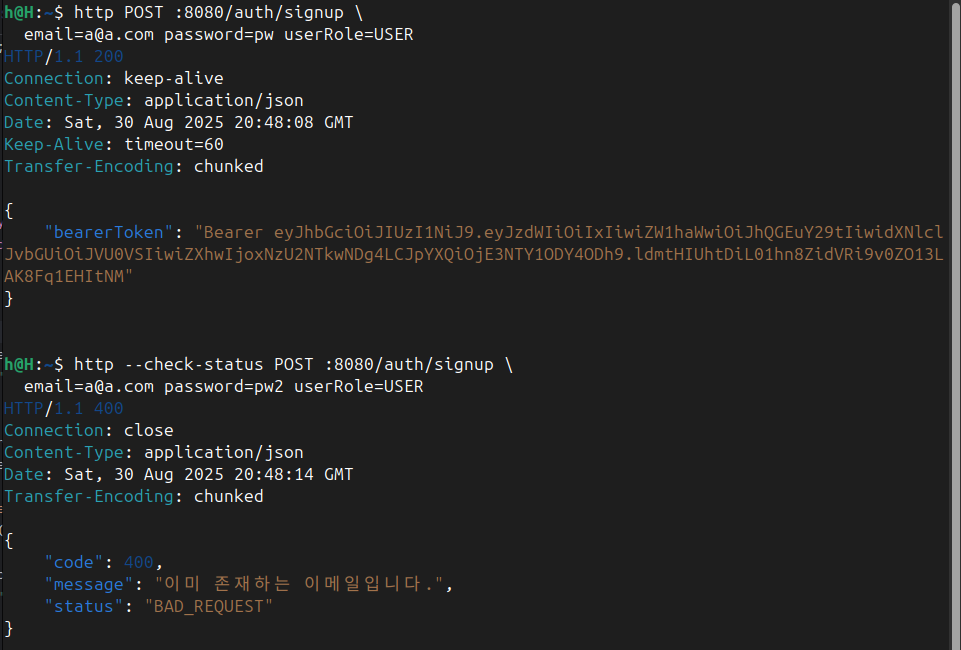
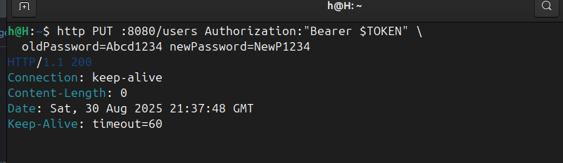

# Lv02-1

## 1) theory

* 목표: 불필요한 연산 제거와 예외 우선순위 정리.
* 원칙:

  * Early return: 가입 불가 조건을 먼저 체크하고 바로 종료.
  * 비용 정렬: 해시는 CPU 고비용이므로 조건 통과 후 실행.
  * 동시성 안전망: 체크-후-삽입 경쟁조건은 DB 유니크 제약으로 방어하고 위반 예외를 도메인 예외로 변환.
  * 트랜잭션: 메서드 전체를 하나의 일관된 변경 단위로 처리.

## 2) example\_code

```java
@Transactional
public SignupResponse signup(SignupRequest req) {
    if (userRepository.existsByEmail(req.getEmail())) {
        throw new InvalidRequestException("이미 존재하는 이메일입니다.");
    }

    UserRole role = UserRole.of(req.getUserRole());
    String encoded = passwordEncoder.encode(req.getPassword());

    try {
        User saved = userRepository.save(new User(req.getEmail(), encoded, role));
        String token = jwtUtil.createToken(saved.getId(), saved.getEmail(), role);
        return new SignupResponse(token);
    } catch (org.springframework.dao.DataIntegrityViolationException e) {
        throw new InvalidRequestException("이미 존재하는 이메일입니다.");
    }
}
```

> 스키마에 이메일 유니크 제약이 있어야 위 안전망이 의미가 있다. 없는 경우 추가 필요.

## 3) execution\_and\_testing\_method

```bash
# 최초 가입
http POST :8080/auth/signup email=a@a.com password=pw userRole=USER

# 동일 이메일 재시도 → 400 기대
http --check-status POST :8080/auth/signup email=a@a.com password=pw2 userRole=USER
```

단위 테스트 포인트:

* `existsByEmail`이 `true`일 때 `passwordEncoder.encode`가 호출되지 않는지 검증.
* 유니크 위반 시 `InvalidRequestException`으로 매핑되는지 검증.

## 4) 캡쳐


---

# Lv02-2

## 1) theory

* 목표: 불필요한 `if-else` 제거. 가드절로 실패 조건을 먼저 처리해 가독성과 유지보수성을 높인다.
* 순서가 핵심: ① HTTP 상태코드 검증 ② 본문 유효성 검사 ③ 도메인 조건 매칭.
* 효과: 분기 수 감소, 조기 실패로 디버깅 용이, happy path가 마지막에 남아 읽기 쉽다.

## 2) example\_code

```java
public String getTodayWeather() {
    ResponseEntity<WeatherDto[]> res =
        restTemplate.getForEntity(buildWeatherApiUri(), WeatherDto[].class);

    if (!HttpStatus.OK.equals(res.getStatusCode())) {
        throw new ServerException("날씨 데이터를 가져오는데 실패했습니다. 상태 코드: " + res.getStatusCode());
    }

    WeatherDto[] arr = res.getBody();
    if (arr == null || arr.length == 0) {
        throw new ServerException("날씨 데이터가 없습니다.");
    }

    String today = getCurrentDate();

    return Arrays.stream(arr)
        .filter(dto -> today.equals(dto.getDate()))
        .map(WeatherDto::getWeather)
        .findFirst()
        .orElseThrow(() -> new ServerException("오늘에 해당하는 날씨 데이터를 찾을 수 없습니다."));
}
```

## 3) execution\_and\_testing\_method

* 단위 테스트 케이스:

  1. 상태코드가 200이 아니면 `ServerException`.
  2. 본문이 `null`이면 `ServerException`.
  3. 본문이 빈 배열이면 `ServerException`.
  4. 오늘 날짜 매칭이 없으면 `ServerException`.
  5. 오늘 날짜 매칭이 있으면 해당 `weather` 반환.
* Mockito 예시:

  ```java
  when(restTemplate.getForEntity(any(URI.class), eq(WeatherDto[].class)))
      .thenReturn(new ResponseEntity<>(array, HttpStatus.OK));
  assertThat(service.getTodayWeather()).isEqualTo("SUNNY");
  ```

---

#Lv02-3

## 1) theory

* 목적: 비밀번호 규칙을 DTO 선언으로 강제. 컨트롤러 진입 전에 실패시켜 불필요한 로직을 차단.
* 메커니즘: Jakarta Bean Validation. 컨트롤러 파라미터에 `@Valid`가 있을 때 DTO 필드의 제약(@NotBlank, @Pattern 등)을 검사.
* 권장 위치: 컨트롤러 경계에서 검증. 서비스에 `@Valid`만 붙이면 동작하지 않는다(프록시를 통한 `@Validated` 필요).

## 2) example\_code

```groovy
// build.gradle
implementation 'org.springframework.boot:spring-boot-starter-validation'
```

```java
// DTO
@Getter
@NoArgsConstructor @AllArgsConstructor
public class UserChangePasswordRequest {
    @NotBlank
    private String oldPassword;

    @NotBlank
    @Pattern(
        regexp = "^(?=.*\\d)(?=.*[A-Z]).{8,}$",
        message = "새 비밀번호는 8자 이상이며 숫자와 대문자를 포함해야 합니다."
    )
    private String newPassword;
}
```

```java
// Controller
@PutMapping("/users/password")
public void changePassword(@Auth AuthUser authUser,
                           @Valid @RequestBody UserChangePasswordRequest req) {
    userService.changePassword(authUser.getId(), req);
}
```

```java
// Service (검증 통과 전제)
@Transactional
public void changePassword(long userId, UserChangePasswordRequest req) {
    User user = userRepository.findById(userId)
        .orElseThrow(() -> new InvalidRequestException("User not found"));

    if (!passwordEncoder.matches(req.getOldPassword(), user.getPassword())) {
        throw new InvalidRequestException("잘못된 비밀번호입니다.");
    }
    if (passwordEncoder.matches(req.getNewPassword(), user.getPassword())) {
        throw new InvalidRequestException("새 비밀번호는 기존 비밀번호와 같을 수 없습니다.");
    }
    user.changePassword(passwordEncoder.encode(req.getNewPassword()));
}
```

> 커스텀 규칙이 필요하면 `@Constraint`로 `@Password` 애노테이션과 `ConstraintValidator`를 정의.

## 3) execution\_and\_testing\_method

```bash
# 로그인 후 토큰 확보
TOKEN=$(http --print=b POST :8080/auth/signin email=a@a.com password=Abcd1234 \
  | jq -r '.bearerToken' | sed 's/^Bearer //')

# 실패 사례: 대문자 없음 → 400
http --check-status PUT :8080/users/password \
  Authorization:"Bearer $TOKEN" \
  oldPassword=Abcd1234 newPassword=abcd1234

# 실패 사례: 8자 미만 → 400
http --check-status PUT :8080/users/password \
  Authorization:"Bearer $TOKEN" \
  oldPassword=Abcd1234 newPassword=Abc123

# 성공 사례 → 200
http PUT :8080/users/password \
  Authorization:"Bearer $TOKEN" \
  oldPassword=Abcd1234 newPassword=NewP1234
```

요약: DTO에 제약을 선언하고 컨트롤러에서 `@Valid`로 트리거한다. 규칙 위반은 컨트롤러 진입 시점에 400으로 종료된다.

## 캡쳐

