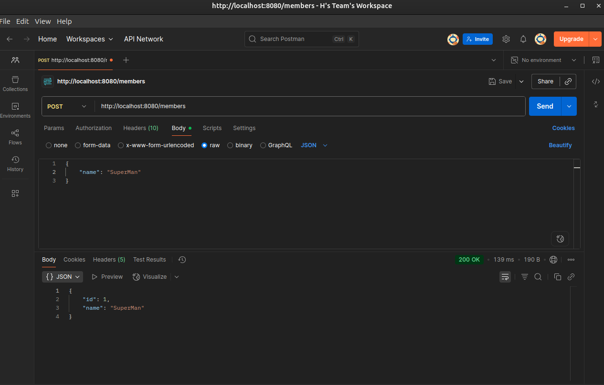
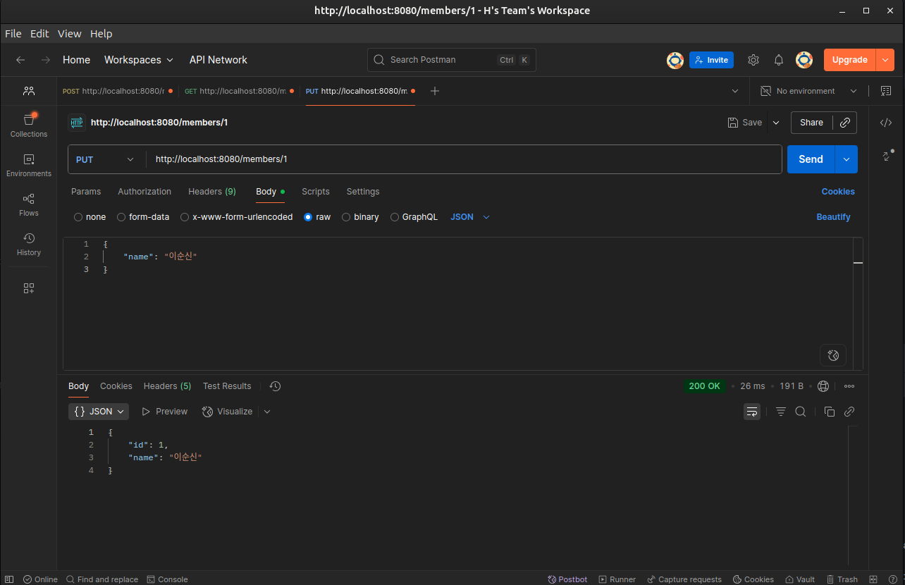
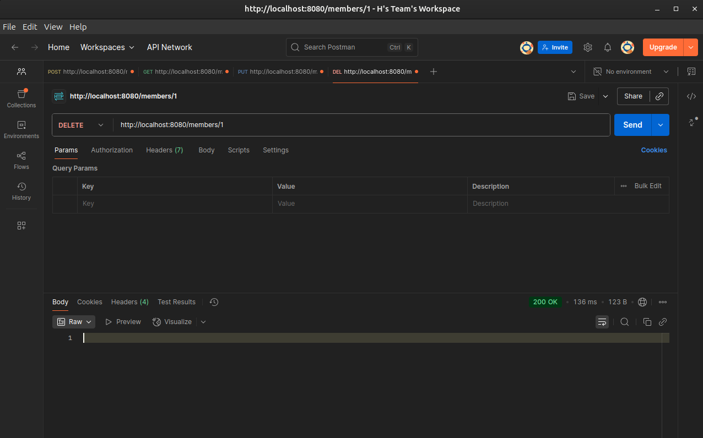
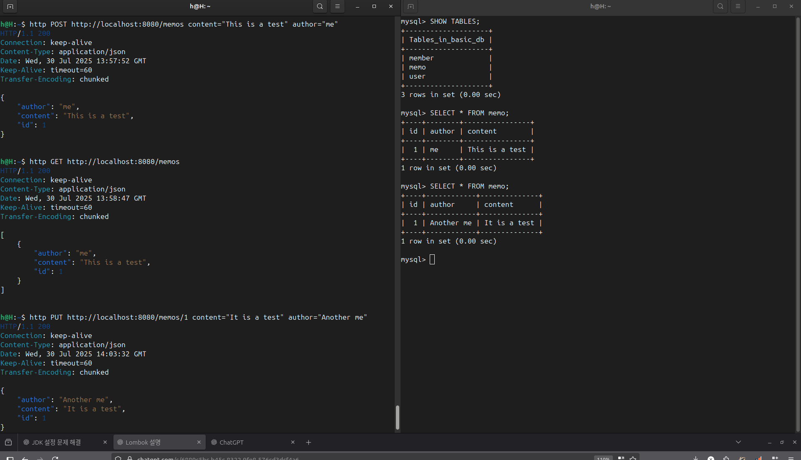
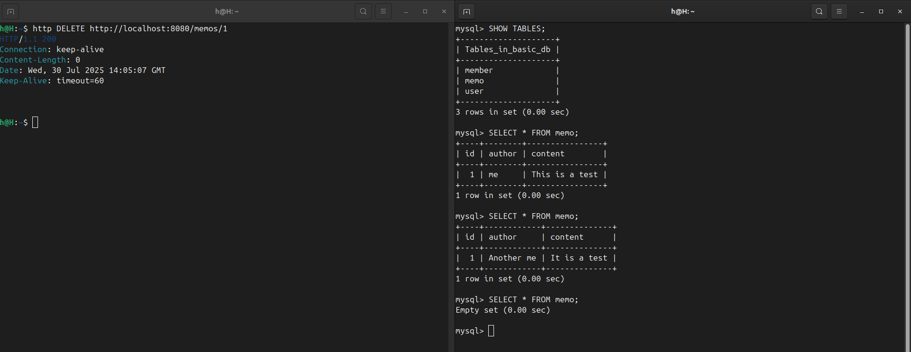

# 🧪 Spring Boot CRUD 실습 정리
## ✅ 1. 프로젝트 개요 (Overview)
- **목표**: Java + Spring Boot 기반의 간단한 REST API 서버 구현 (CRUD 지원)
- **주제**: `Member`, `Memo`, `User` 엔티티에 대한 CRUD 기능 구현
- **기술 스택**:
  - Java 17
  - Spring Boot
  - MySQL
  - Postman
  - httpie

---

## ✅ 2. API 기능 요약 (API Summary)
각 엔티티마다 다음과 같은 기능을 구현함:

- `POST /[엔티티]`: 새 데이터 등록
- `GET /[엔티티]`: 전체 목록 조회
- `GET /[엔티티]/{id}`: 특정 항목 조회
- `PUT /[엔티티]/{id}`: 특정 항목 수정
- `DELETE /[엔티티]/{id}`: 특정 항목 삭제

| 엔티티 | 기본 URI         |
|--------|------------------|
| Member | `/members`       |
| Memo   | `/memos`         |
| User   | `/users`         |

---

## ✅ 3. 테스트 방식 정리 (Testing Methods)
| 도구       | 장점                                         | 단점                                 |
|------------|----------------------------------------------|--------------------------------------|
| **Postman** | GUI 기반, 시각적 테스트에 강함, Collections 저장 가능 | 무겁고, 터미널 환경에서 불편          |
| **httpie**  | curl보다 간결, JSON 자동 정리, 가독성 좋음          | 별도 설치 필요, 커뮤니티 규모 작음     |

---

## ✅ 4. 실습 결과 (Result Snapshots)
- ✅ Postman을 통한 CRUD 테스트 성공
- ✅ CLI에서 httpie로 데이터 등록/삭제 확인
- ✅ `AUTO_INCREMENT` 초기화까지 CLI에서 직접 수행 (`ALTER TABLE ... AUTO_INCREMENT = 1`)
- ✅ 각 컨트롤러 클래스의 `@RequestMapping("/entity + s")` 경로에 따라 URL 지정 가능함

---

## 5. 📷 CRUD 캡쳐

### 🖥️ Postman





---

### 🔧 httpie



---

## 6. Class 관계도

### 클래스 관계 구조
```plaintext
[Controller 계층]
┌────────────────────────────┐
│      MemberController      │
│  └─ @RestController        │
│  └─ @RequestMapping("/members") │
│  └─ 의존성: MemberService   │
└────────────────────────────┘
                │
                ▼
[Service 계층]
┌────────────────────────────┐
│        MemberService       │
│  └─ @Service               │
│  └─ @Transactional         │
│  └─ 의존성: MemberRepository │
│  └─ 메서드: save, update, findAll, findOne, delete │
└────────────────────────────┘
                │
                ▼
[Repository 계층]
┌────────────────────────────┐
│       MemberRepository     │
│  └─ extends JpaRepository<Member, Long> │
└────────────────────────────┘
                │
                ▼
[도메인 (Entity)]
┌────────────────────────────┐
│          Member            │
│  └─ @Entity                │
│  └─ 필드: id, name         │
└────────────────────────────┘

[DTO 계층]
┌────────────────────────────┐
│     MemberRequestDto       │
│  └─ 필드: name             │
└────────────────────────────┘

┌────────────────────────────┐
│     MemberResponseDto      │
│  └─ 필드: id, name         │
└────────────────────────────┘
```

### 📌 핵심 흐름 요약
1. `MemberController`는 HTTP 요청을 받음 (POST, GET, PUT, DELETE)
2. `MemberService`로 요청 위임하여 비즈니스 로직 수행
3. `MemberRepository`를 통해 DB 접근 (`save()`, `findById()`, 등)
4. 응답으로 `MemberResponseDto`를 반환하거나, 요청에 `MemberRequestDto` 사용
5. 실제 저장/조회되는 데이터는 `Member` 엔티티


