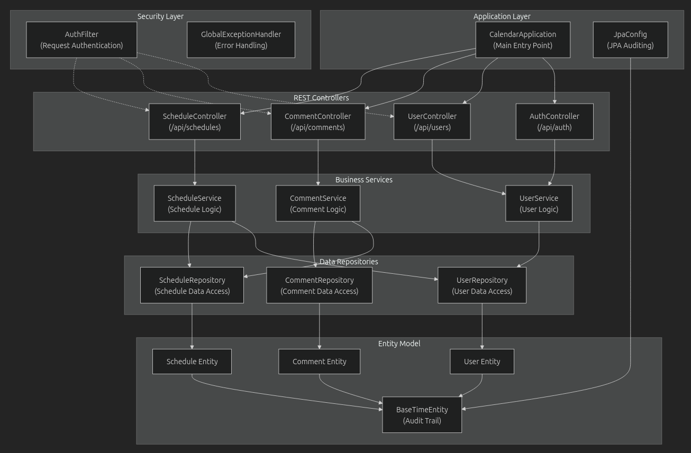
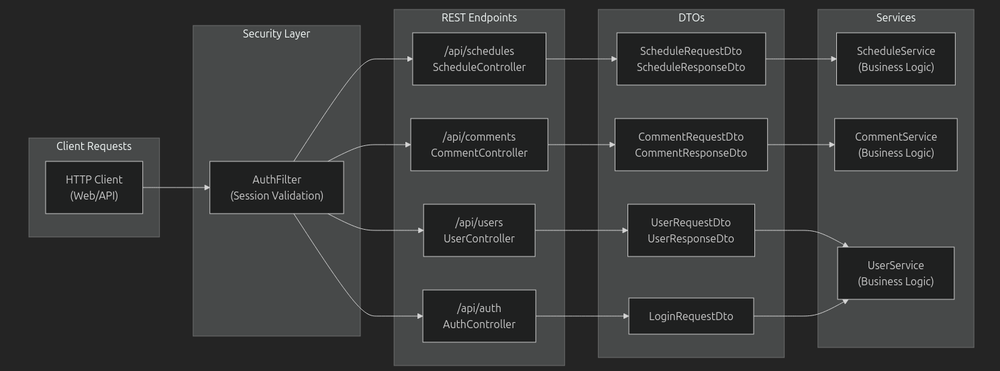
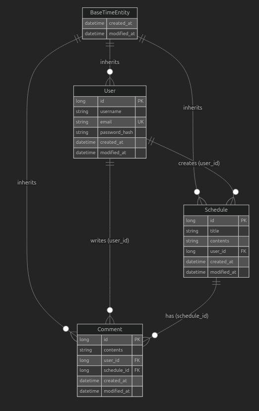

# 프로젝트 문서

## 계층형 아키텍처 구성 요소

| 계층 | 구성 요소 | 책임 |
|------|-----------|------|
| REST API | `ScheduleController`, `CommentController`, `UserController` | HTTP 요청 처리, 검증 |
| 비즈니스 로직 | `ScheduleService`, `CommentService`, `UserService` | 비즈니스 규칙, 데이터 처리 |
| 데이터 접근 | `ScheduleRepository`, `CommentRepository`, `UserRepository` | 데이터베이스 작업 |
| 데이터 모델 | `Schedule`, `Comment`, `User`, `BaseTimeEntity` | 엔티티 정의, 관계 |
| 보안 | `AuthFilter`, `SecurityConfig` | 인증, 비밀번호 인코딩 |

---

## API

| 메서드 | 엔드포인트 | 인증 |
| --- | --- | --- |
| POST | `/api/auth/login` | 없음 |
| DELETE | `/api/auth/logout` | 세션 필요 |
| GET | `/api/auth/me` | 세션 필요 |
| POST | `/api/users` | 없음 |
| GET | `/api/users/{id}` | 없음 |
| POST | `/api/schedules` | 세션 필요 (생성자 = 세션 유저) |
| GET | `/api/schedules/{id}` | 없음 |
| PUT | `/api/schedules/{id}` | 소유자 세션 |
| DELETE | `/api/schedules/{id}` | 소유자 세션 |
| GET | `/api/schedules/page` | (프로젝트 정책에 따라) 공개 또는 화이트리스트 |
| POST | `/api/comments` | 세션 필요 (작성자 = 세션 유저) |
| GET | `/api/comments/{id}` | 없음 |
| PUT | `/api/comments/{id}` | 작성자 세션 |
| DELETE | `/api/comments/{id}` | 작성자 세션 |
| GET | `/api/schedules/{scheduleId}/comments` | 없음 |

---

## ERD

---

## 기술 스택

### 코어 프레임워크
- **Spring Boot 3.5.4**: 메인 애플리케이션 프레임워크
- **Spring Web**: REST API 컨트롤러와 HTTP 처리
- **Spring Data JPA**: 데이터 영속성과 레포지토리 패턴
- **Spring Security**: 비밀번호 인코딩 및 인증

### 데이터 관리
- **JPA/Hibernate**: 객체-관계 매핑
- **MySQL**: 운영 데이터베이스
- **H2**: 개발 및 테스트 데이터베이스

### 개발 도구
- **Gradle 8.14.3**: 빌드 자동화 및 의존성 관리
- **Lombok**: 엔티티 코드 생성
- **Spring DevTools**: 개발 시 유틸리티

---

## 오류 처리 및 응답 코드

이 시스템은 표준화된 HTTP 상태 코드를 사용하여 포괄적인 오류 처리를 구현합니다.

| 상태 코드 | 용도 | 처리 주체 |
|-----------|------|-----------|
| **200 OK** | GET/PUT 요청 성공 | 모든 컨트롤러 |
| **201 Created** | POST 요청 성공 | 생성(Create) 엔드포인트 |
| **204 No Content** | DELETE 요청 성공 | 삭제(Delete) 엔드포인트 |
| **400 Bad Request** | 유효성 검사 실패, 잘못된 파라미터 | `GlobalExceptionHandler` |
| **401 Unauthorized** | 인증 필요 | `AuthFilter` |
| **403 Forbidden** | 권한 부족(인가 실패) | 서비스 레이어 검증 |
| **404 Not Found** | 리소스를 찾을 수 없음 | 리포지토리 레이어 |

