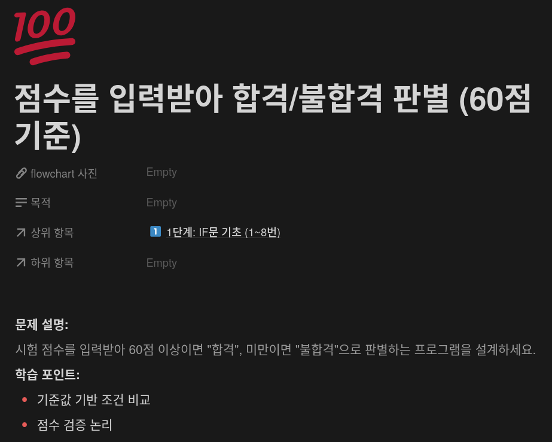
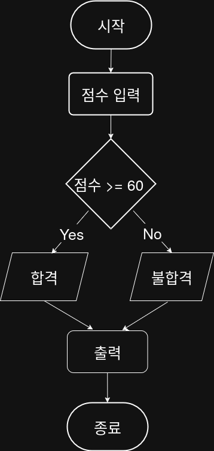

## 문제


## 정답


## Java
```java
import java.util.Scanner;

public class Main {
    public static void main(String[] args) {
        Scanner sc = new Scanner(System.in);
        
        System.out.print("점수를 입력하세요: ");
        int score = sc.nextInt();
        
        if (score >= 60) {
            System.out.println("합격");
        } else {
            System.out,println("불합격");
        }
        
        sc.close();
    }
}
```
