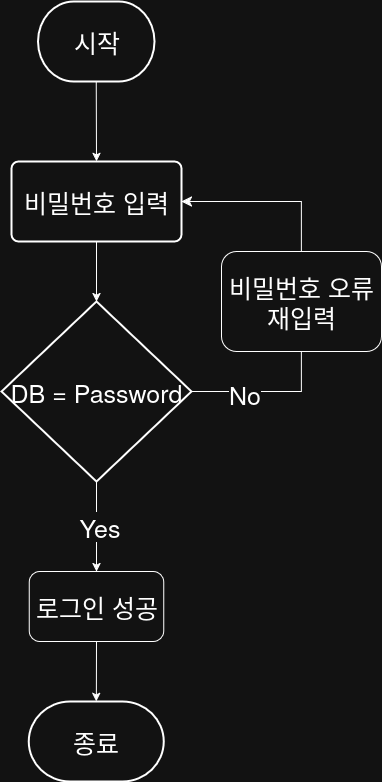

## 문제


## 정답


## Java
```java
import java.util.Scanner;

public class Main {
    public static void main(String[] args) {
        final String DB_PASSWORD = "1234";
        Scanner sc = new Scanner(System.in);
        String input;
        
        while (true) {
            System.out.print("비밀번호를 입력하세요: ");
            input = sc.nextLine();
            
            if (input.equals(DB_PASSWORD)) {
                System.out.println("로그인 성공");
                break;
            } else {
                System.out.println("비밀번호 오류, 재입력");
            }
        }
        
        sc.close();
    }
}
```
        


