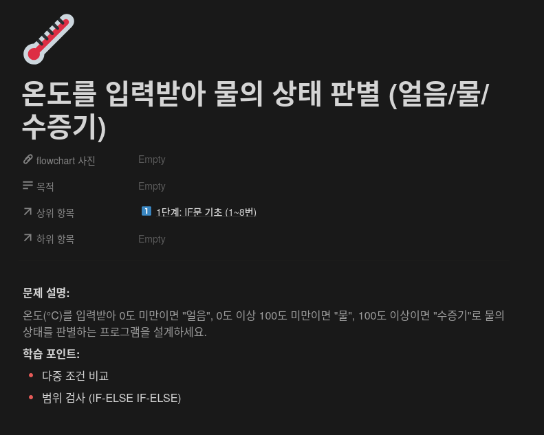
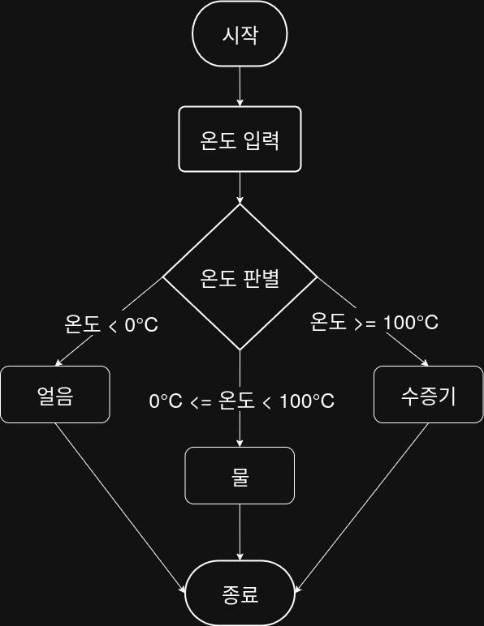

## 문제


## 정답


## Java
```java
import java.util.Scanner;

public class Main {
    public static void main(String[] args) {
        Scanner sc = new Scanner(System.in);
        
        System.out.println("온도를 입력하세요(℃): ");
        int temp = sc.nextInt();
        
        if (temp < 0) {
            System.out.println("얼음");
        } else if (temp < 100) {
            System.out.println("물");
        } else {
            System.out.println("수증기");
        }
        
        sc.close();
    }
}
```

