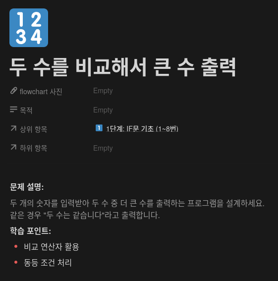
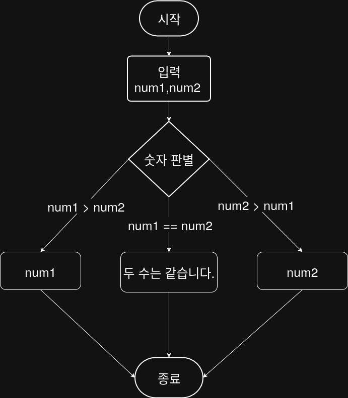

## 문제


## 정답


## Java
```java
import java.util.Scanner;

public class Main {
    public static void main(String[] args) {
        Scanner sc = new Scanner(System.in);
        
        System.out.print("첫 번째 숫자를 입력하세요: ");
        int num1 = sc.nextInt();
        
        System.out.print("두 번째 숫자를 입력하세요: ");
        int num2 = sc.nextInt();
        
        if (num1 > num2) {
            System.out.println(num1);
        } else if (num2 > num1) {
            System.out.println(num2);
        } else {
            System.out.println("두 수는 같습니다.");
        }
        
        sc.close();
    }
}
```
