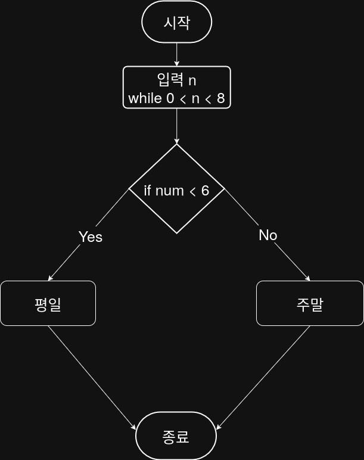

## 문제


## 정답


## Java
```java
import java.util.Scanner;

public class Main {
    public static void main(String[] args) {
        Scanner sc = new Scanner(System.in);
        
        System.out.print("요일을 입력하세요 (1~7): ");
        int day = sc.nextInt();
        
        if (day >= 1 && day <= 5) {
            System.out.println("평일");
        } else if (day == 6 || day == 7) {
            System.out.println("주말");
        } else {
            System.out.println("잘못된 입력입니다.);
        }
        
        sc.close();
    }
}
```

## Tip
Java에서는 1 <= day <= 5처럼 수학식처럼 연속 비교를 사용할 수 없습니다.
왜냐하면 (1 <= day)는 boolean 값을 반환하고, 그다음 boolean <= 5는 타입 오류를 발생시키기 때문입니다.

따라서 아래처럼 논리 연산자 &&를 사용해 조건을 나누어 표현해야 합니다:

```java
if (day >= 1 && day <= 5)
```

※ 이 방식은 Java뿐 아니라 C, C++, JavaScript 등 대부분의 언어에서도 동일하게 적용됩니다.
