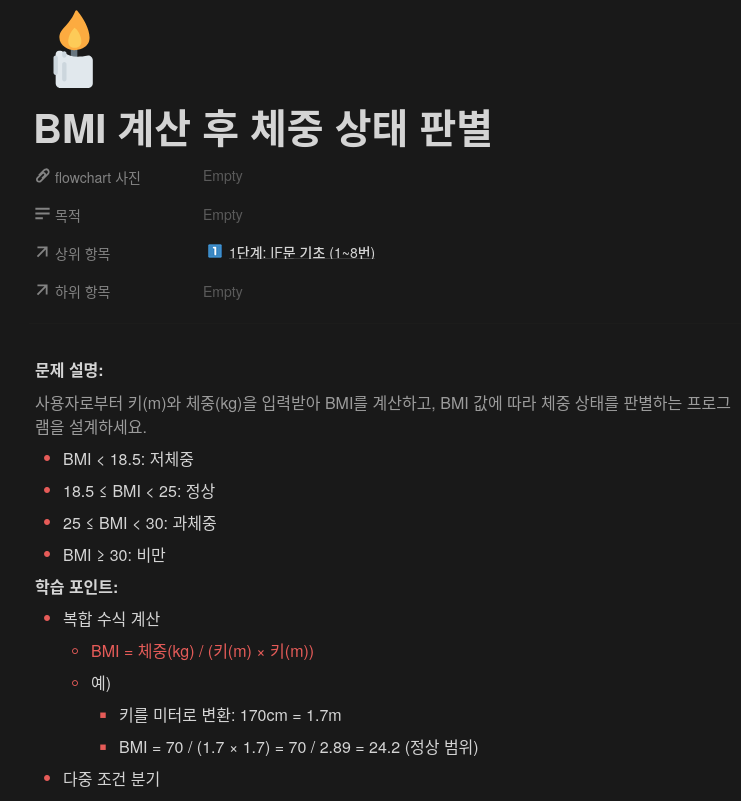
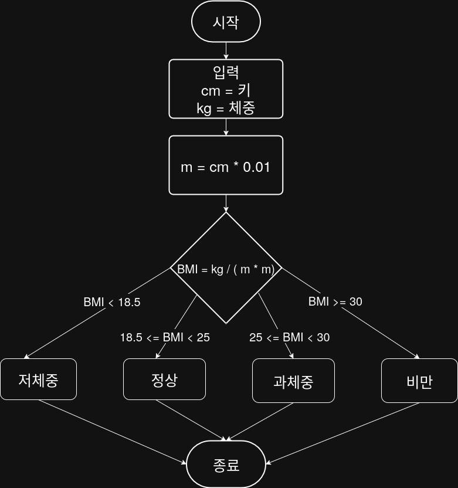

## 문제


## 정답


## Java
```java
import java.util.Scanner;

public class Main {
    public static void main(String[] args) {
        Scanner sc = new Scanner(System.in);
        
        System.out.print("키(cm)을 입력하세요: ");
        double heightCm = sc.nextDouble();
        
        System.out.print("체중(kg)을 입력하세요: ");
        double weight = sc.nextDouble();
        
        double heightM = heightCm ** 0.01;
        double bmi = weight / (heightM * heightM);
        
        if (bmi < 18.5) {
            System.out.println("저체중);
        } else if (bmi < 25) {
            System.out.println("정상");
        } else if (bmi < 30) {
            System.out.println("과체중");
        } else {
            System.out.println("비만");
        }
        
        sc.close();
    }
}
```
