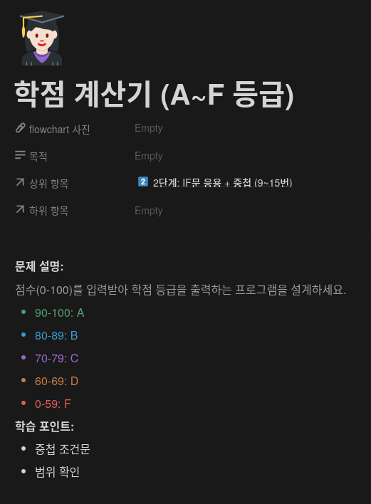
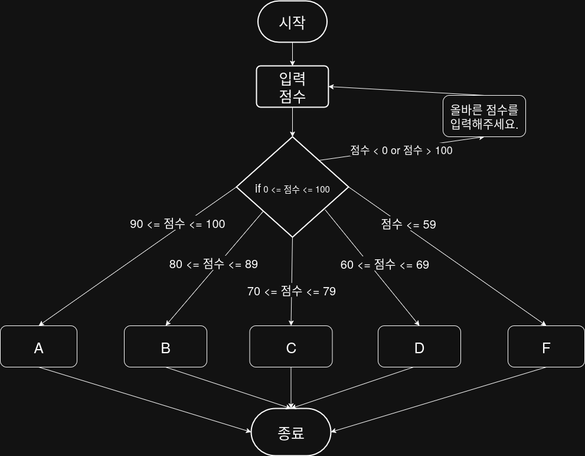

## 문제


## 정답


## Java
```java
import java.util.Scanner;

public class Main {
    public static void main(String[] args) {
        Scanner sc = new Scanner(System.in);
        
        System.out.print("점수를 입력하세요 (0 ~ 100): ");
        int score = sc.nextInt();
        
        if (score < 0 || score > 100) {
            System.out.println("올바른 점수를 입력해주세요.");
        } else if (score >= 90) {
            System.out.println("A");
        } else if (score >= 80) {
            System.out.println("B");
        } else if (score >= 70) {
            System.out.println("C");
        } else if (score >= 60) {
            System.out.println("D");
        } else {
            System.out.println("F");
        }
        
        sc.close();
    }
}
```
            
