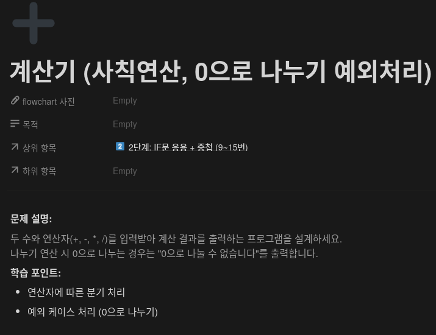
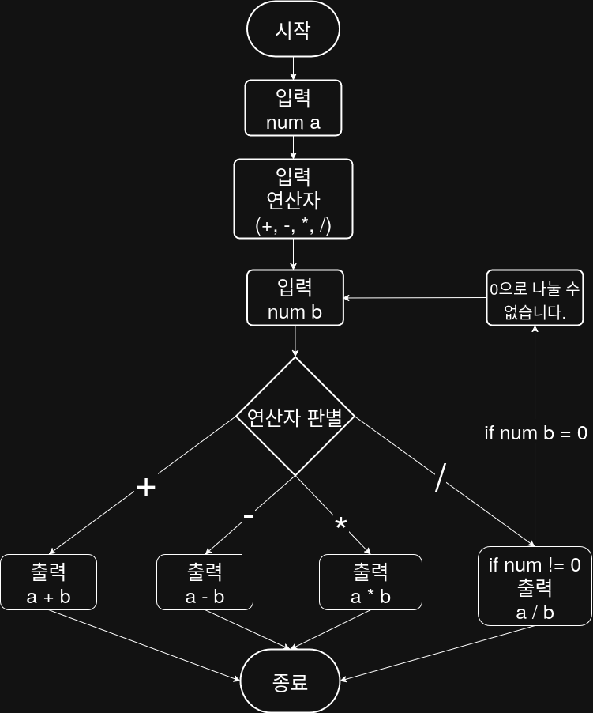

## 문제


## 정답


## Java
```java
import java.util.Scanner;

public class Main {
    public static void main(String[] args) {
        Scanner sc = new Scanner(System.in);
        
        System.out.print("첫 번째 숫자를 입력하세요: ");
        int a = sc.nextInt();
        
        System.out.print("연산자를 입력하세요 (+, -, *, /): ");
        String op = sc.next();
        
        System.out.print("두 번째 수를 입력하세요: ");
        int b = sc.nextInt();
        
        if (op.equals("+")) {
            System.out.println("결과: " + (a + b));
        } else if (op.equals("-")) {
            System.out.println("결과: " + (a - b));
        } else if (op.equals("*")) {
            System.out.println("결과: " + (a * b);;
        } else if (op.equals("/")) {
            if (b == 0) {
                System.out.println("0으로 나눌 수 없습니다.");
            } else {
                System.out.println("결과: " + ((dobule)a / b));
            }
        } else {
            System.out.println("올바른 연산자를 입력하세요.");
        }
        
        sc.close();
    }
}
```
