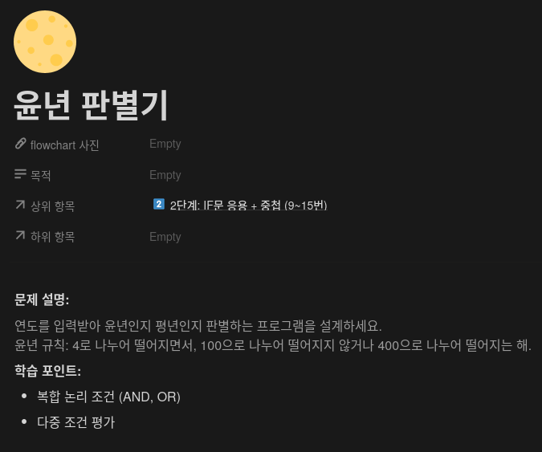
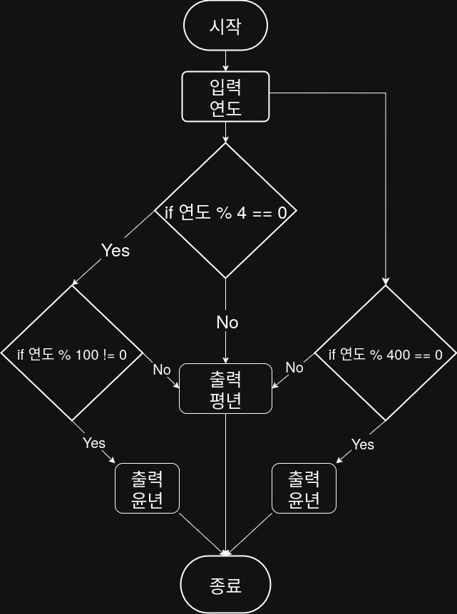

## 문제


## 정답


## Java
```java
import java.util.Scanner;

public class Main {
    public static void main(String[] args) {
        Scanner sc = new Scanner(System.in);
        
        System.out.print("연도를 입력하세요: ");
        int year = sc.nextInt();
        
        if ((year % 4 == 0 && year && 100 != 0 || (year % 400 == 0 )) {
            System.out.println("윤년");
        } else )
            System.out.println("평년");
        }
        
        sc.close();
    }
}
```
