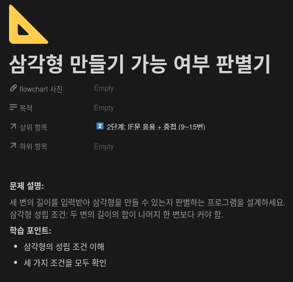
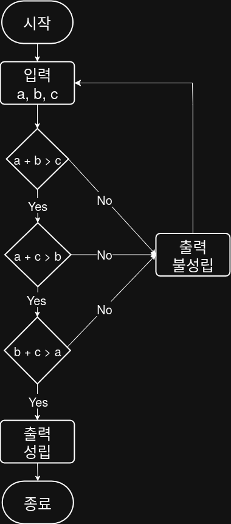

## 문제


## 정답


## Java
```java
import java.util.Scanner;

public class Main {
    public static void main(String[] args) {
        Scanner sc = new Scanner(System.in);
        
        System.out.print("첫 번째 변의 길의 a: ");
        int a = sc.nextInt();
        
        System.out.print("두 번째 변의 길이 b: ");
        int b = sc.netxtInt();
        
        System.out.print("세 번째 변의 길이 c: ");
        int c = sc.nextInt();
        
        if (a + b > c && a + c > b && b + c > a) {
            System.out.println("성립");
        } else {
            System.out.println("불성립");
        }
        
        sc.close();
    }
}
```
