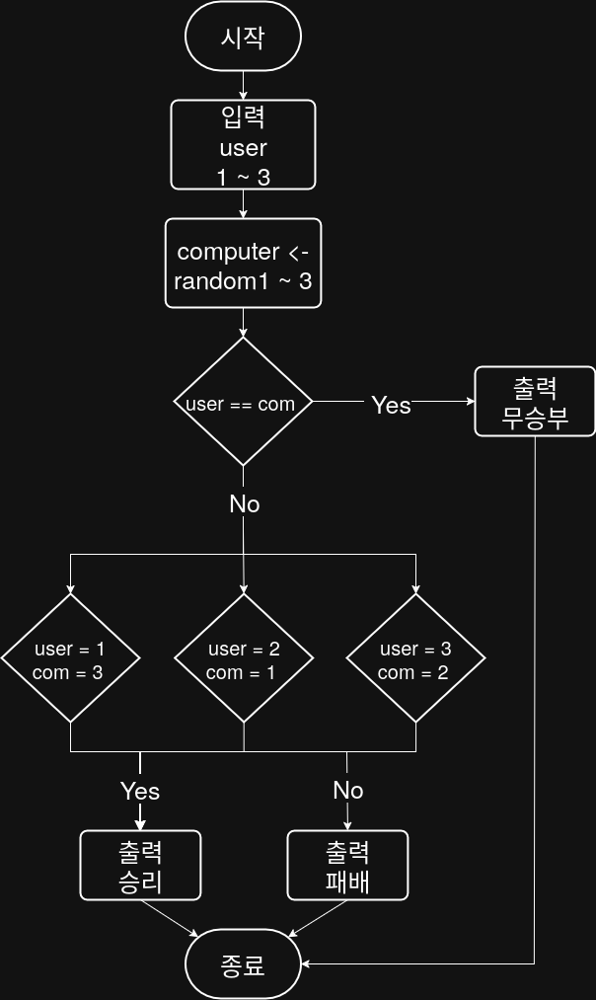

## 문제


## 정답


## Java
```java
import java.util.Scanner;
import java.util.Random;

public class Main {
    public static void main(String[] args) {
        Scanner sc = new Scanner(System.in);
        Random rd = new Random();
        
        System.out.println("가위(1), 바위(2), 보(3) 중 하나를 선택하세요: ");
        int user = sc.nextInt();
        
        int com = rd.nextInt(3) + 1;
        
        System.out.println("컴퓨터 선택: " + com);
        
        if (user == com) {
            System.out.println("무승부");
        } else if (
            (user == 1 && com == 3) ||
            (user == 2 && com == 1) ||
            (user == 3 && com == 2
        ) {
            System.out.println("승리");
        } else {
            System.out.println("패배");
        }
        
        sc.close();
    }
}
```
        
