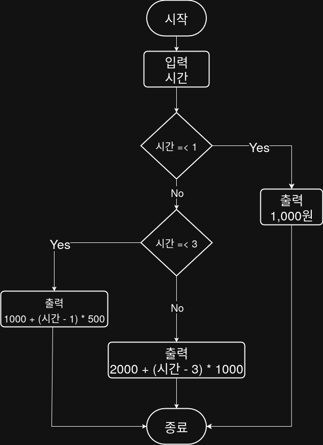

## 문제


## 정답


## Java
```java
import java.util.Scanner;

public class Main {
    public static void main(String[] args) {
        Scanner sc = new Scanner(System.in);
        
        System.out.print("주차 시간을 입력하세요: ");
        int time = sc.nextInt();
        
        int fee;
        
        if (time <= 1) {
            fee = 1000;
        } else if (time <= 3) {
            fee = 1000 + (time - 1) * 500;
        } else {
            fee = 2000 + (time - 3) * 1000;
        }
        
        System.out.println("주차 요금: " + fee + "원");
        
        sc.close();
    }
}
```
        
        
        
