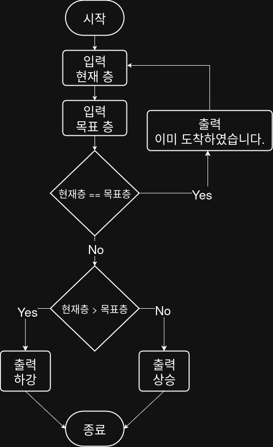

## 문제


## 정답


## Java
```java
import java.util.Scanner;

public class Main {
    public static void main(String[] args) {
        Scanner sc = new Scanner(System.in);
        
        System.out.print("현재 층을 입력하세요: ");
        int current = sc.nextInt();
        
        System.out.print("목표 층을 입력하세요: ");
        int target = sc.nextInt();
        
        if (current == target) {
            System.out.println("이미 도착하였습니다.");
        } else if (current > target) {
            System.out.println("하강");
        } else {
            System.out.println("상승");
        }
        
        sc.close();
    }
}
```
