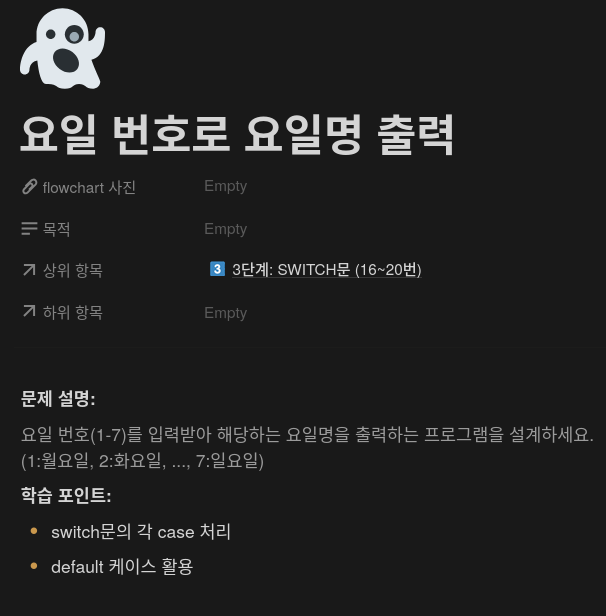
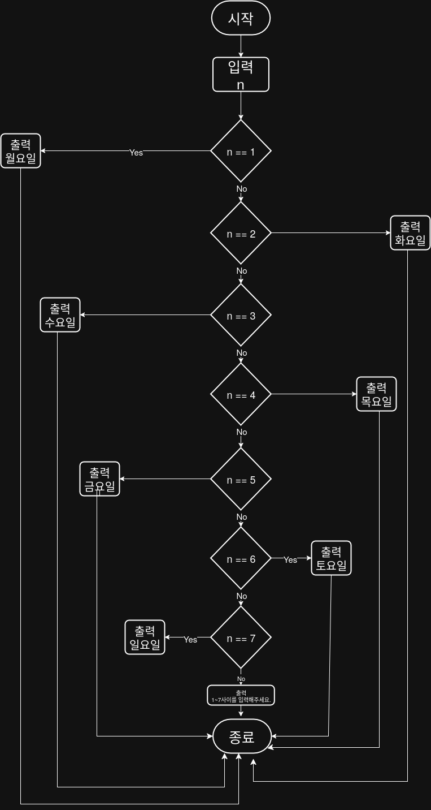

## 문제


## 정답


## Java
```java
import java.util.Scanner;

public class Main {
    public static void main(String[] args) {
        Scanner sc = new Scanner(System.in);
        
        System.out.print("요일 번호를 입력하세요 (1~7): ");
        int day = sc.nextInt();
        
        switch (day) {
            case 1:
                System.out.println("월요일");
                break;
            case 2:
                System.out.println("화요일");
                break;
            case 3:
                System.out.println("수요일");
                break;
            case 4:
                System.out.println("목요일");
                break;
            case 5:
                System.out.println("금요일");
            case 6:
                System.out.println("토요일");
            case 7:
                System.out.println("일요일");
                break;
            default
                System.out.println("1~7 사이의 숫자를 입력해주세요.");
        }
        
        sc.close();
    }
}
```
