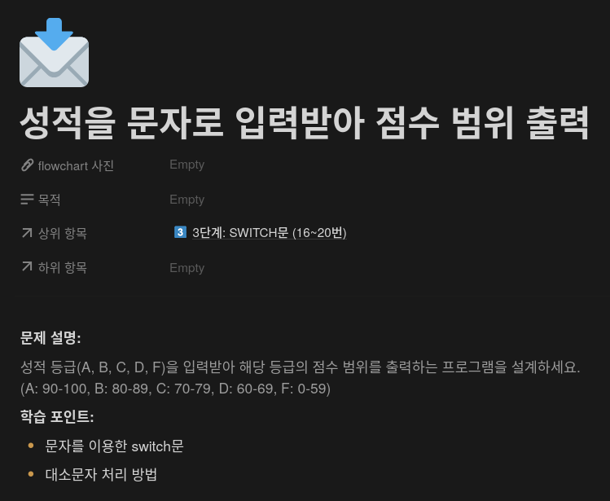
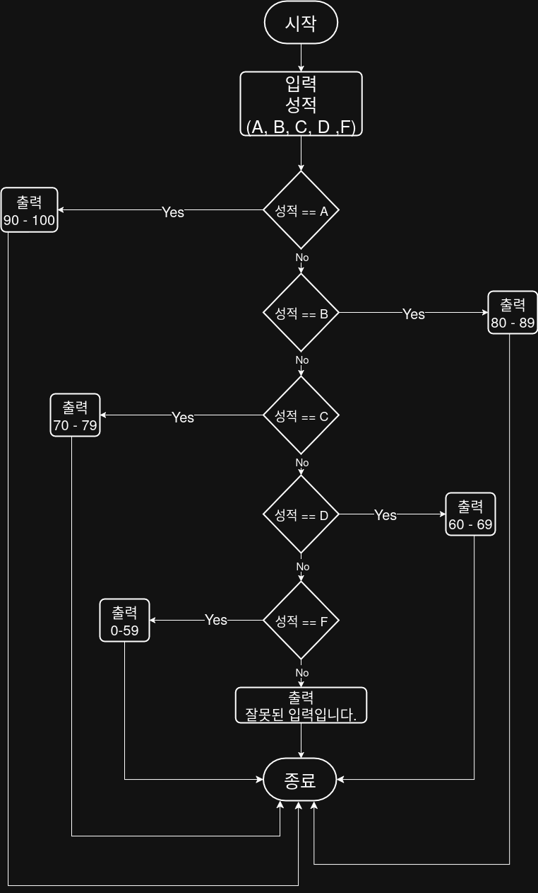

## 문제


## 정답


## Java
```java
import java.util.Scanner;

public class Main {
    public static void main(String[] args) {
        Scanner sc = new Scanner(System.in);
        
        System.out.print("성적 등급을 입력하세요 (A, B, C, D, F): ");
        String grade = sc.next().toUpperCase();
        
        switch (grade) {
            case "A":
                System.out.println("90 - 100");
                break;
            case "B":
                System.out.println("80 - 89");
                break;
            case "C":
                System.out.println("70 - 79");
                break;
            case "D":
                System.out.println("60 - 69");
                break;
            case "F":
                System.out.println("0 - 59");
                break
            default:
                System.out.println("잘못된 입력입니다.");
        }
        
        sc.close();
    }
}
```
