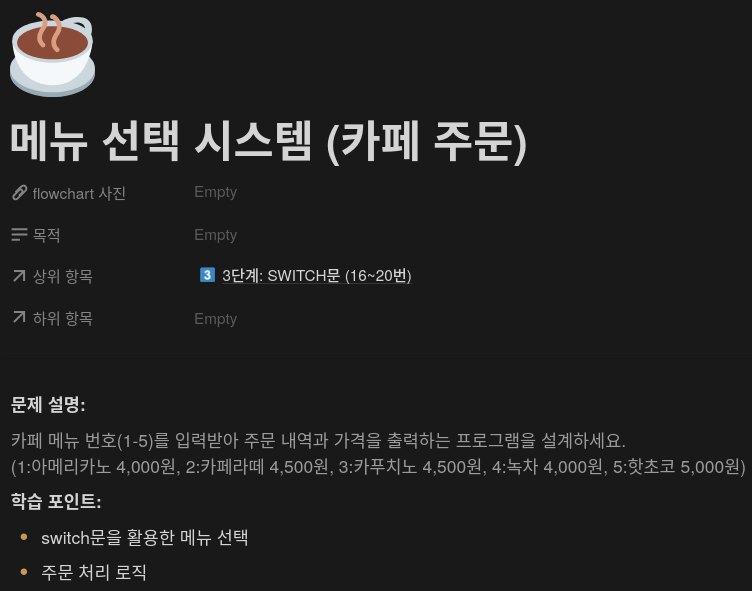
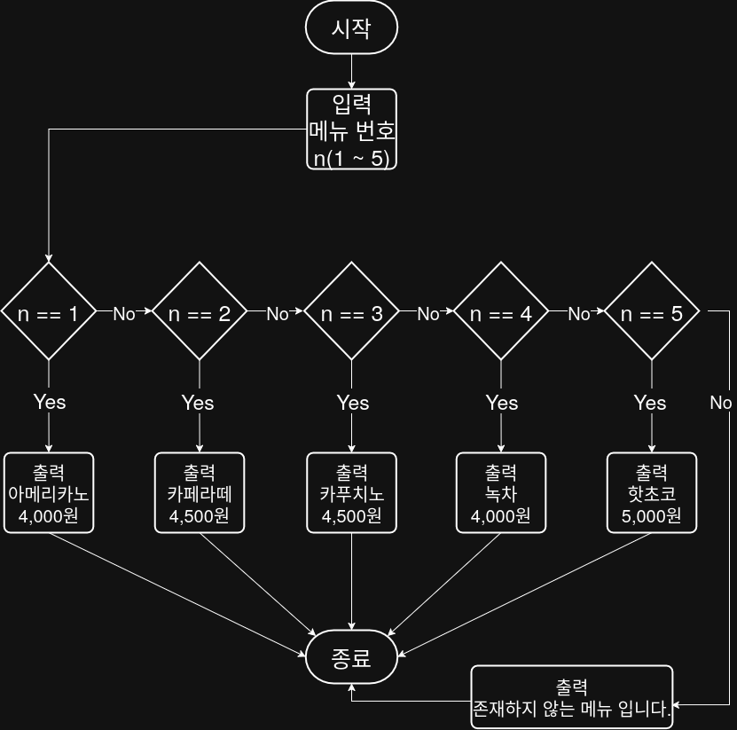

## 문제


## 정답


## Java
```java
import java.util.Scanner;

public class Main {
    public static void main(String[] args) {
        Scanner sc = new Scanner(System.in);
        
        System.out.print("메뉴 번호를 입력하세요 (1 ~ 5): ");
        int menu = sc.nextInt();
        
        switch (menu) {
            case 1:
                System.out.println("아메리카노 4,000원");
                break;
            case 2:
                System.out.println("카페라뗴 4,500원");
                break;
            case 3:
                System.out.println("카푸치노 4,500원");
                break;
            case 4:
                System.out.println("녹차 4,000원");
                break;
            case 5
                System.out.println("핫초코 5,000원);
                break;
            default:
                System.out.println("존재하지 않는 메뉴입니다.");
        }
        
        sc.close();
    }
}
```
