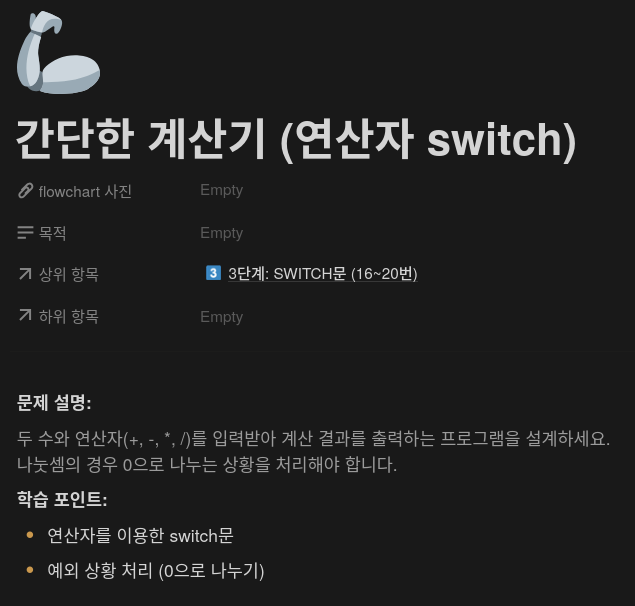
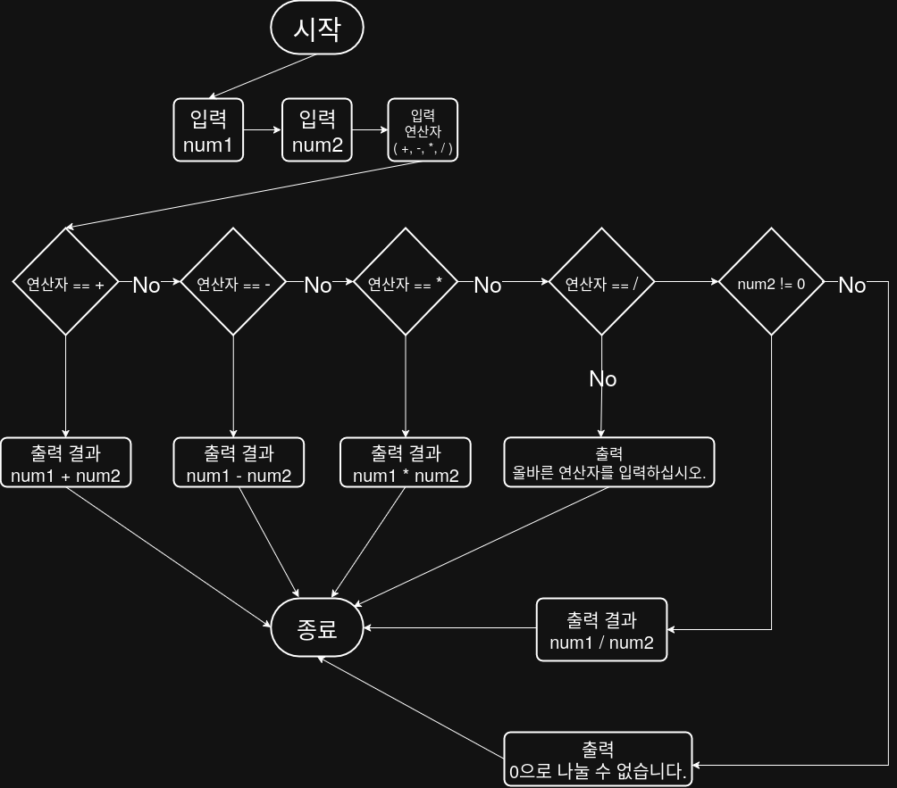

## 문제


## 정답


## Java
```java
import java.util.Scanner;

public class Main {
    public static void main(String[] args) {
        Scanner sc = new Scanner(System.in);
        
        System.out.print("첫 번째 수를 입력하세요: ");
        int num1 = sc.nextInt();
        
        System.out.print("두 번째 수를 입력하세요: ");
        int num2 = sc.nextInt();
        
        System.out.print("연산자를 입력하세요 (+, -, *, /): ");
        String op = sc.next();
        
        switch (op) {
            case "+":
                System.out.println("결과: " + (num1 + num2));
                break;
            case "-":
                System.out.println("결과: " + (num1 - num2));
                break;
            case "*":
                System.out.println("결과: " + (num1 * num2));
                break;
            case "/":
                if (num2 == 0) {
                    System.out.println("0으로 나눌 수 없습니다.");
                } else {
                    System.out.println("결과: " + ((double) num1 / num2));
                }
                break;
            default:
                System.out.println("올바른 연산자를 입력하십시오.");
        }
        
        sc.close();
    }
}
```
