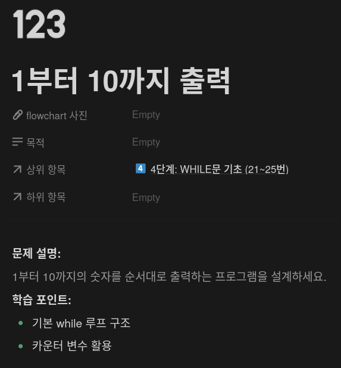
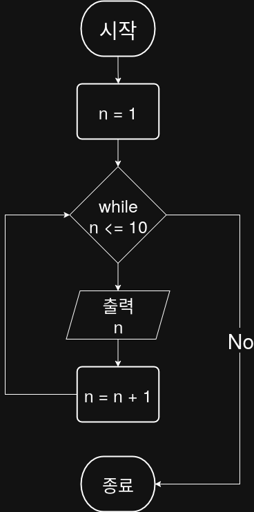

## 문제


## 정답


## Python3
```python
n = 1
while n <= 10:
    print(n)
    n += 1
```

## Java
```java
public class Main {
    public static void main(String[] args) {
        int n = 1;
        
        while (n <= 10) {
            System.out.println(n);
            n++;
        }
    }
}
```

