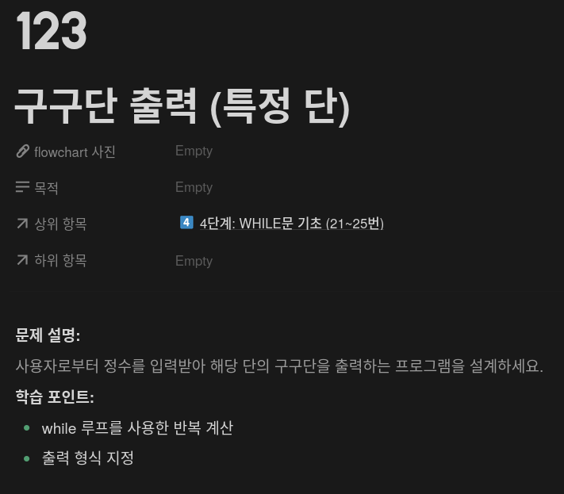
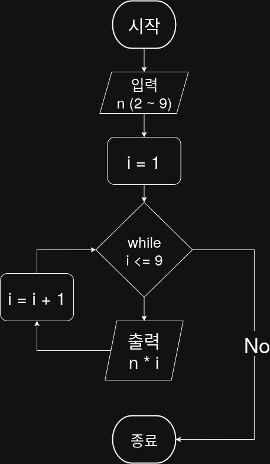

## 문제


## 정답


## Java
```java
import java.util.Scanner;

public class Main {
    public static void main(String[] args) {
        Scanner sc = new Scanner(System.in);
        System.out.print("출력할 단을 입력하세요 (2~9): ");
        int n = sc.nextInt();

        int i = 1;
        while (i <= 9) {
            System.out.println(n + " * " + i + " = " + (n * i));
            i++;
        }

        sc.close();
    }
}
```

