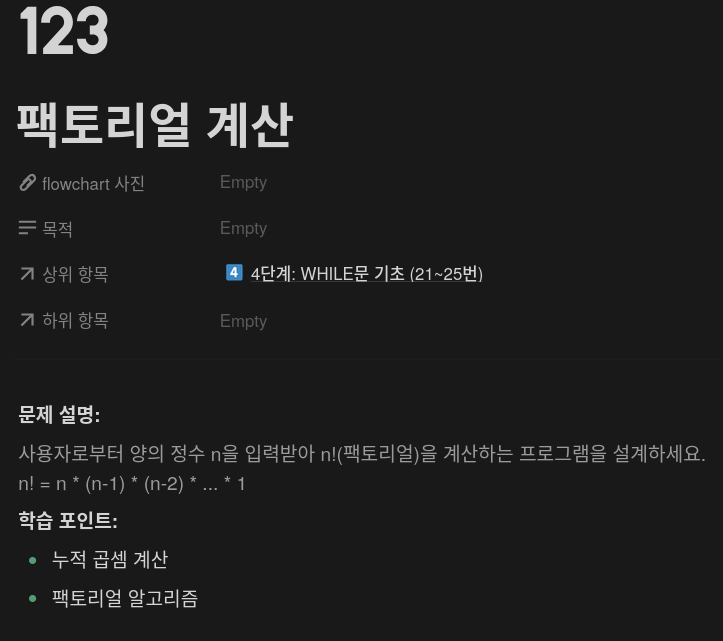
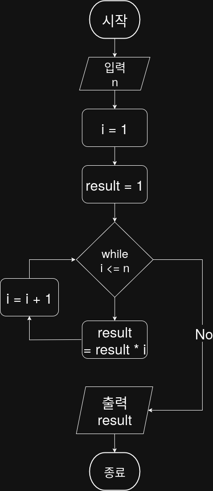

## 문제


## 정답


---

## Java
```java
public class Main {
    public static int solution(int n) {
        int i = 1;
        int result = 1;

        while (i <= n) {
            result *= i;
            i++;
        }

        return result;
    }
```
