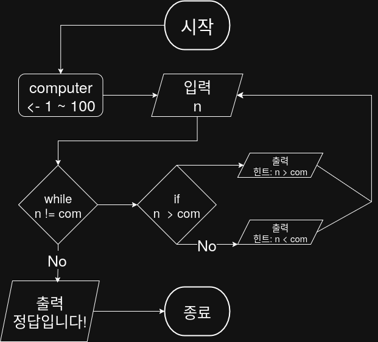

## 문제


## 정답


## Java
```java
import java.util.Scanner;
import java.util.Random;

public class Main {
    public static void main(String[] args) {
        Scanner sc = new Scanner(System.in);
        Random rand = new Random();
        
        int com = rand.nextInt(100) + 1; // 1부터 100 사이 랜덤 숫자

        while (true) {
            System.out.print("숫자 입력: ");
            int n = sc.nextInt();

            if (n == com) {
                System.out.println("정답입니다!");
                break;
            } else if (n > com) {
                System.out.println("힌트: n > com");
            } else {
                System.out.println("힌트: n < com");
            }
        }

        sc.close();
    }
}
```

## Tip
- 대부분의 프로그래밍 언어에서 반복 조건은 **맞을 때까지 계속 반복**보다 **틀린 동안 반복**으로 더 자주 표현
- n == com인 경우엔 루프를 빠져나와 "정답입니다!"를 출력 → 종료
- 정답 처리(탈출)는 루프 바깥, 오답 처리는 루프 안에서 계속 반복
