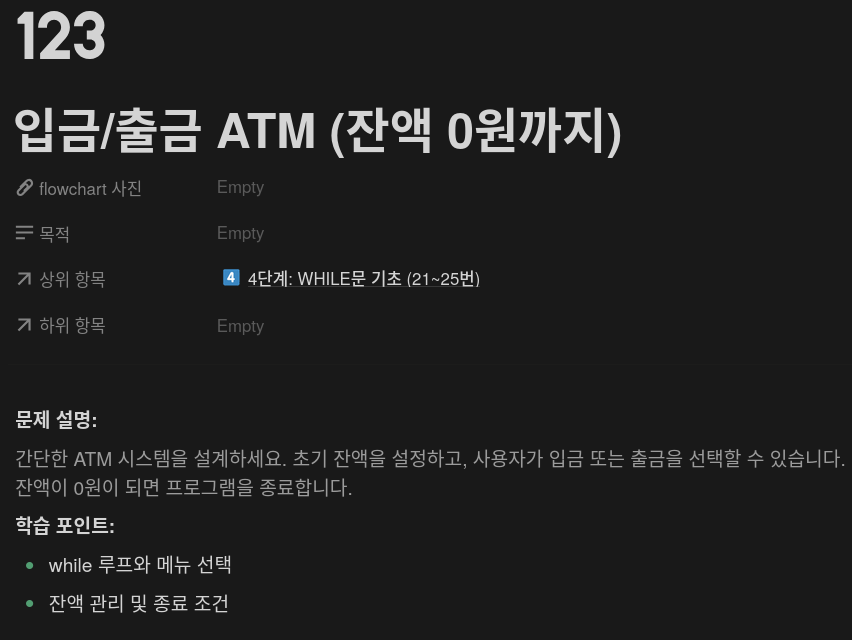
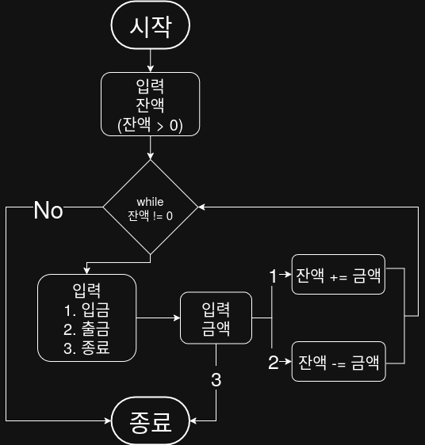

## 문제


## 정답


## Java
```java
import java.util.Scanner;

public class Main {
    public static void main(String[] args) {
        Scanner sc = new Scanner(System.in);
        int balance;

        System.out.print("초기 잔액을 입력하세요: ");
        balance = sc.nextInt();  // 잔액 > 0

        while (balance != 0) {
            System.out.println("\n[메뉴] 1. 입금  2. 출금  3. 종료");
            System.out.print("번호를 입력하세요: ");
            int choice = sc.nextInt();

            if (choice == 1) {
                System.out.print("입금 금액: ");
                int amount = sc.nextInt();
                balance += amount;
                System.out.println("현재 잔액: " + balance);
            } else if (choice == 2) {
                System.out.print("출금 금액: ");
                int amount = sc.nextInt();
                balance -= amount;
                System.out.println("현재 잔액: " + balance);
            } else if (choice == 3) {
                System.out.println("프로그램을 종료합니다.");
                break;
            } else {
                System.out.println("올바른 메뉴를 선택하세요.");
            }
        }

        System.out.println("잔액이 0원이 되어 종료되었습니다.");
        sc.close();
    }
}
```
