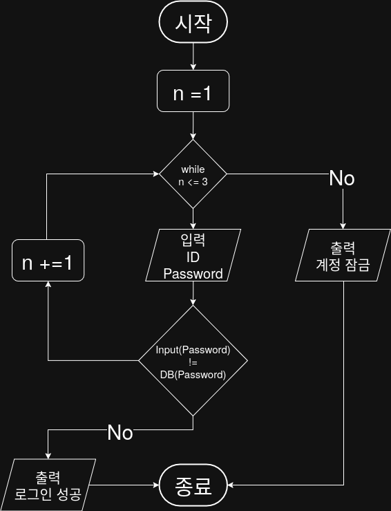

## 문제


## 정답


## Java
```java
import java.util.Scanner;

public class LoginSystem {
    public static void main(String[] args) {
        final String CORRECT_ID = "admin";
        final String CORRECT_PASSWRD = "1234";
        
        Scanner sc = new Scanner(System.in);
        int attempts = 1;
        
        while(attempts <= 3) {
            System.out.print("ID 입력: ");
            String inputId = sc.nextLind();
            
            System.out.print("Password 입력: ");
            String inputPw = sc.nextLine();
            
            if (inputId.equals(COREECT_ID) && inputPw.equals(CORRECT_PASSWORD)) {
                System.out.println("로그인 성공");
                return;
            } else {
                attempts++;
            }
        }
        
        System.out.println("계정 잠금");
        sc.close();
        }
    }
```
