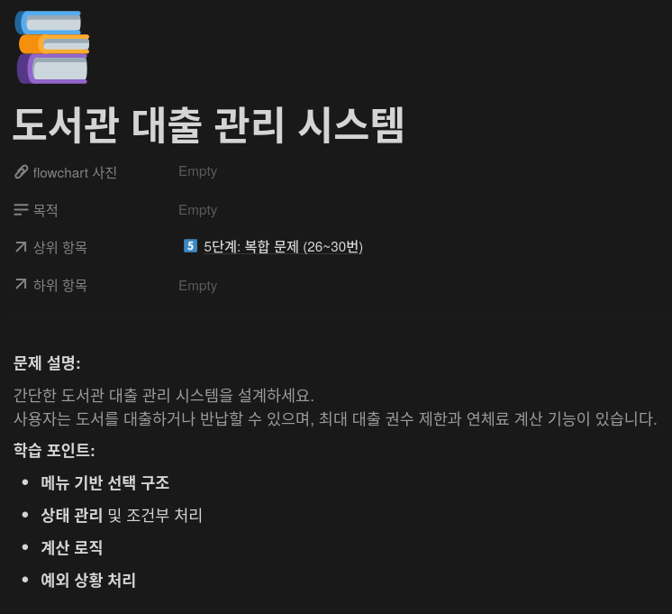
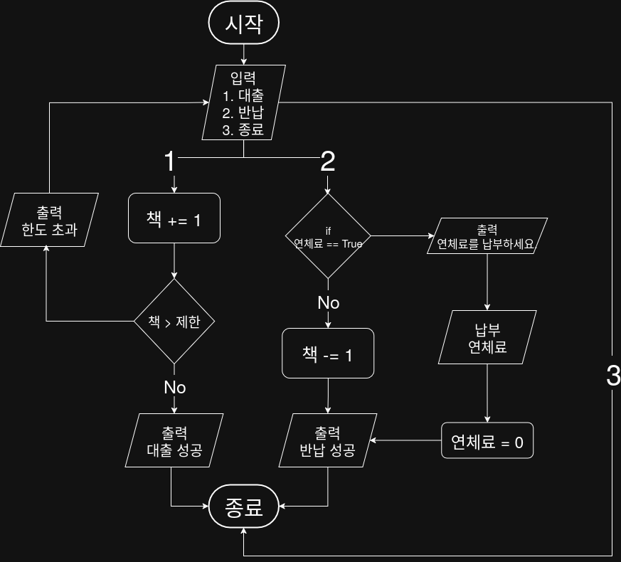

## 문제


## 정답


## Java
```java
import java.util.Scanner;

public class LibrarySystem {
    public static void main(String[] args) {
        Scanner sc = new Scanner(System.in);
        int borrowed = 0;
        int limit = 3;
        boolean hasOverdue = false;
        
        while (true) {
            System.out.println("메뉴를 선택하세요.");
            System.out.println("1.대출");
            System.out.println("2.반납");
            System.out.println("3.종료");
            int choice = sc.nextlnt();
            
            if (choice == 1) {
                borrowed += 1;
                if (borrowed > limit) {
                    System.out.println("대출 한도 초과");
                    borrowed -= 1;
                } else {
                    System.out.println("대출 성공");
                }
            } else if (choice == 2) {
                if (hasOverdue) {
                    System.out.println("연체료를 납부하세요.");
                    System.out.println("연체료를 납부하셨습니까? (true/false):");
                    hasOverdue = !sc.nextboolean();
                    if (hasOverdue) continue;
                }
                borrowed -= 1;
                System.out.println("반납 성공");
            } else if (choice == 3) {
                System.out.println("프로그램을 종료합니다.");
                break;
            } else {
                System.out.println("잘못된 입력입니다.");
            }
        }
        
        sc.close();
        }
    }
```
            
            
                
