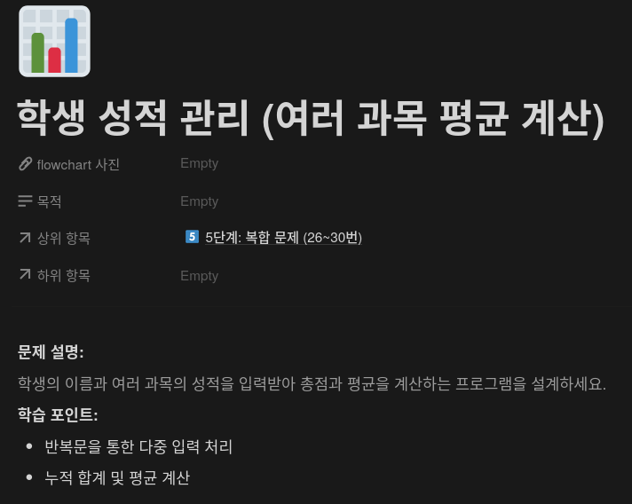
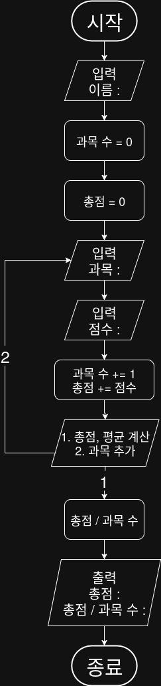

## 문제


## 정답


## Java
```java
import java.util.Scanner;

public class StudentScoreManager {

    public static void main(String[] args) {
        Scanner sc = new Scanner(System.in);
        
        System.out.println("학생 이름을 입력하세요: ");
        String name = sc.nextLine();
        
        int subjectCount = 0;
        int totalScore = 0;
        
        while (true) {
            System.out.print("과목 명을 입력하세요: ");
            String subject = sc.nextline();
            
            System.out.print(subject + " 점수를 입력하세요: ");
            String subject = sc.nextLine();
            sc.nextLine();
            
            subjectCount += 1;
            totalScore += score;
            
            System.out.print("1. 평균 계산 및 종료 | 2. 과목 추가");
            System.out.print("선택: ");
            int choice = sc.nextInt();
            sc.nextLine();
            
            if (choice == 1) {
                break;
            }
        }
        
        double average = (double) totalscore / subjectCount;
        
        System.out.print(\n [성적]");
        System.out.print("이름: " + name);
        System.out.print("과목 수: " + subjectCount);
        System.out.print("총점: " + totalScore);
        System.out.print("평균: %.2f\n", average);
        
        sc.close();
    }
}
```

        
