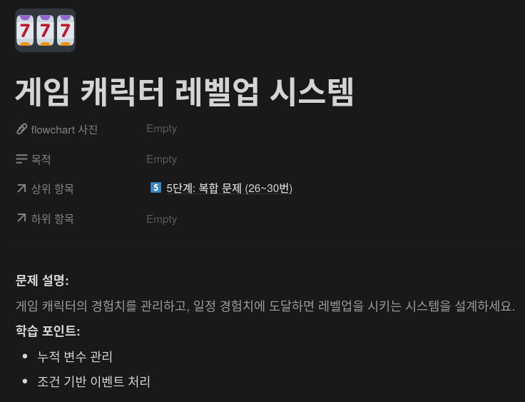
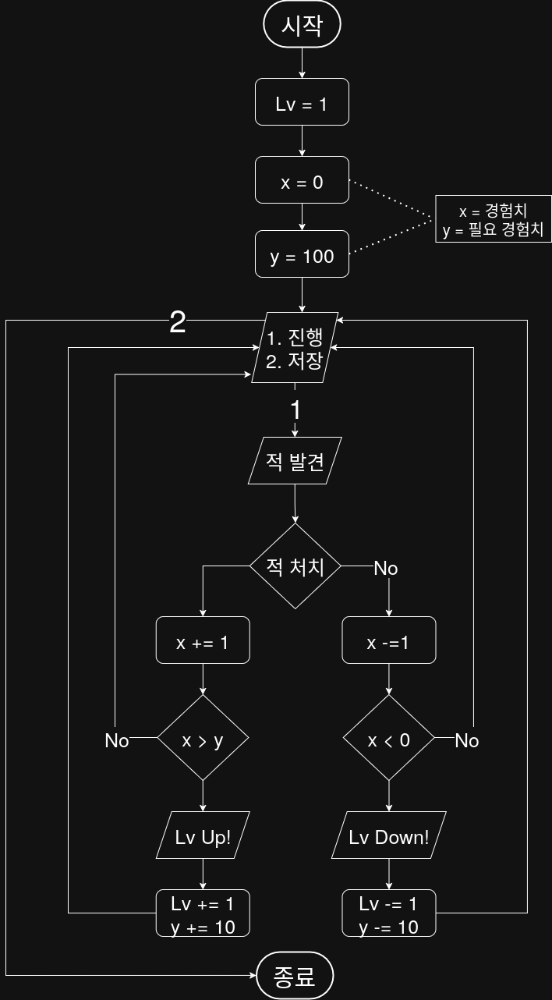

## 문제


## 정답


## Java
```java
import java.util.Scanner;

public class GameLevelSystem {

    public static void main(String[] args) {
        Scanner sc = new Scanner(System.in);
        
        int level = 1;
        int experience = 0;
        int requiredExperience = 100;
        
        System.out.println("게임을 시작합니다!");
        
        while (true) {
            System.out.println("\n현재 레벨: Lv" + level);
            System.out.println("경험치: " + experience + " / " + requiredExperience);
            System.out.println("1. 진행 | 2. 저장 후 종료);
            System.out.println("선택: ");
            int choice = sc.nextInt();
            
            if (choice == 2) {
                System.out.println("게임을 저장하고 종료합니다.");
                break;
            }
            
            System.out.println(">> 적을 발견했습니다!");
            System.out.print("적을 처치하시겠습니까? (1: 예, 2: 아니오): ");
            int fight = sc.nextInt();
            
            if (fight == 1) {
                exprience += 1;
                System.out.println("적을 처치했습니다! 경험치 +1");
            } else
                exprience -= 1;
                System.out.println("적을 놓쳤습니다... 경험치 -1");
            }
            
            if (experience > requiredExprience) {
                level += 1;
                requiredExprience += 10;
                System.out.println("Lv up! -> 현재 Lv: " + level + ", 필요경험치: " + requiredExperience);
                
            if (experience > 0) {
                level += 1;
                requiredExprience += 10;
                System.out.println("Lv Down... -> 현재 Lv: " + level + ", 필요경험치: " + requiredExperience);
            }
        }
        
        sc.close();
    }
}
```
                
