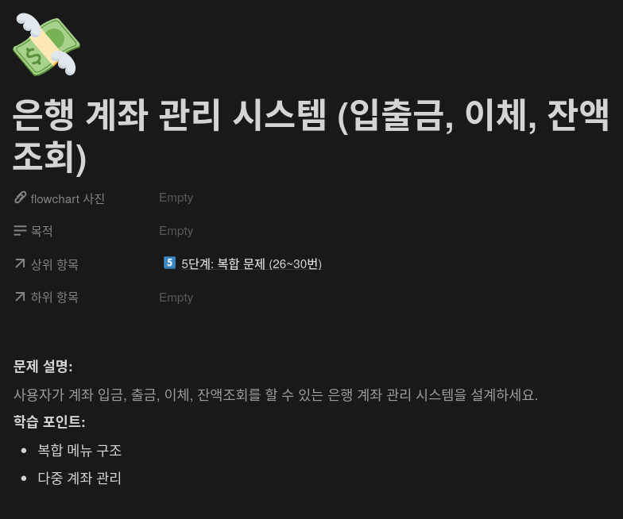
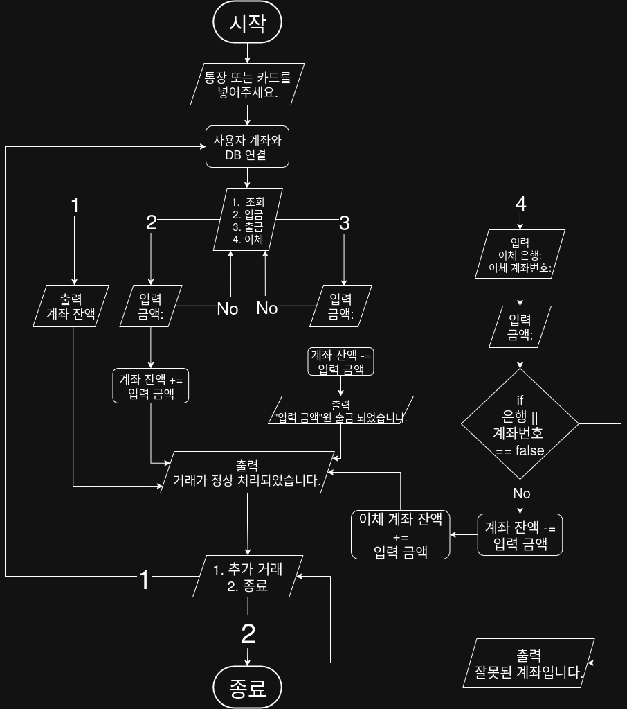

## 문제


## 정답


## Java
```java
import java.util.HashMap;
import java.util.Map;
import java.util.Scanner;

public class BankSystem {
    static Map<String, Integer> accounts = new HashMap<>();
    
    public static void main(String[] args) {
        Scanner sc = new Scanner(System.in);
        
        // 테스트용 샘플 계좌
        accounts.put("user", 10000);
        accounts.put("other", 5000);
        
        System.out.println("통장 또는 카드를 넣어주세요.");
        String account = "user";
        
        while (true) {
            System.out.println("1. 조회 | 2. 입금 | 3. 출금 | 4. 이체");
            int menu = sc.nextInt();
            
            if (menu == 1) {
                System.out.println("현재 잔액: " + accounts.get(account));
            } else if (menu == 2) {
                System.out.print("입금할 금액: ")
                int amount = sc.nextInt();
                accounts.put(account, accounts.get(account) + amount);
                System.out.println("거래가 정상 처리 되었습니다.");
            } else if (menu == 3) {
                System.out.println("출금할 금액: ");
                int amount = sc.nextInt();
                if (amount > accounts.get(account)) {
                    System.out.println("잔액이 부족합니다.);
                } else {
                    accounts.put(account, accounts.get(account) - amount);
                    System.out.println(amount + "원 출금 되었습니다.");
                } 
            } else if (menu == 4) {
                System.out.print("이체할 계좌명 입력: ");
                String target = sc.next();
                if (!accounts.containsKey(target)) {
                    System.out.println("잘못된 계좌입니다.");
                } else {
                    System.out.print("이체할 금액: ")"
                    int amount = sc.nextInt();
                    if (amount > accounts.get(account)) {
                        System.out.println("잔액이 부족합니다.");
                    } else [
                        accounts.put(account, accounts.get(account) - amount);
                        accounts.put(target, accounts.get(target) + amount);
                        System.out.println("이체가 완료되었습니다.");
                    }
                }
            }
            
            System.out.println("1. 추가 거래 | 2. 종료");
            int next = sc.nextInt();
            if (next == 2) {
                System.out.println("프로그램을 종료합니다.");
                break;
            }
        }
        
        sc.close();
    }
}
```
