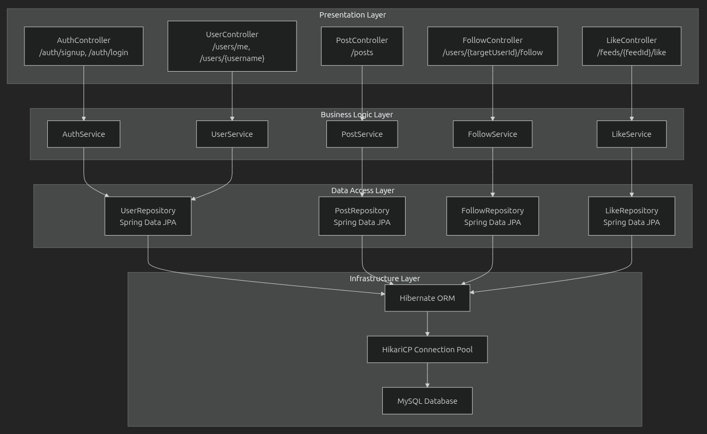
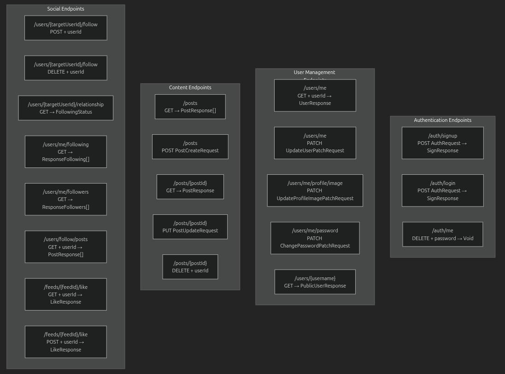
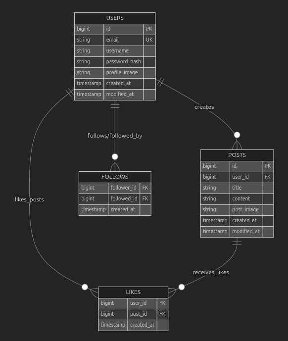
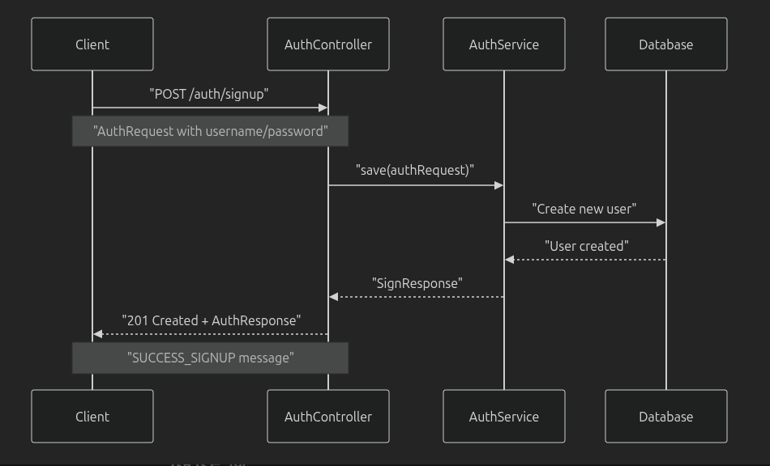
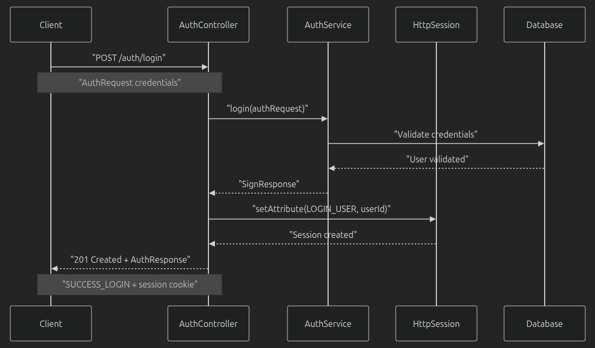
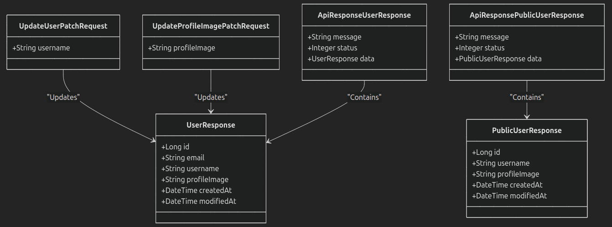
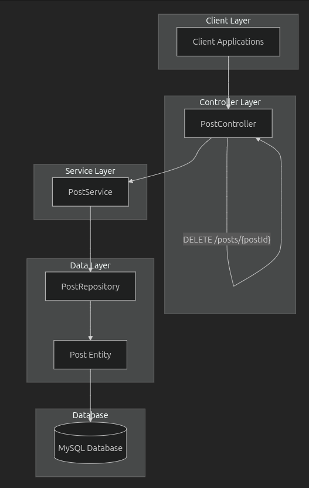
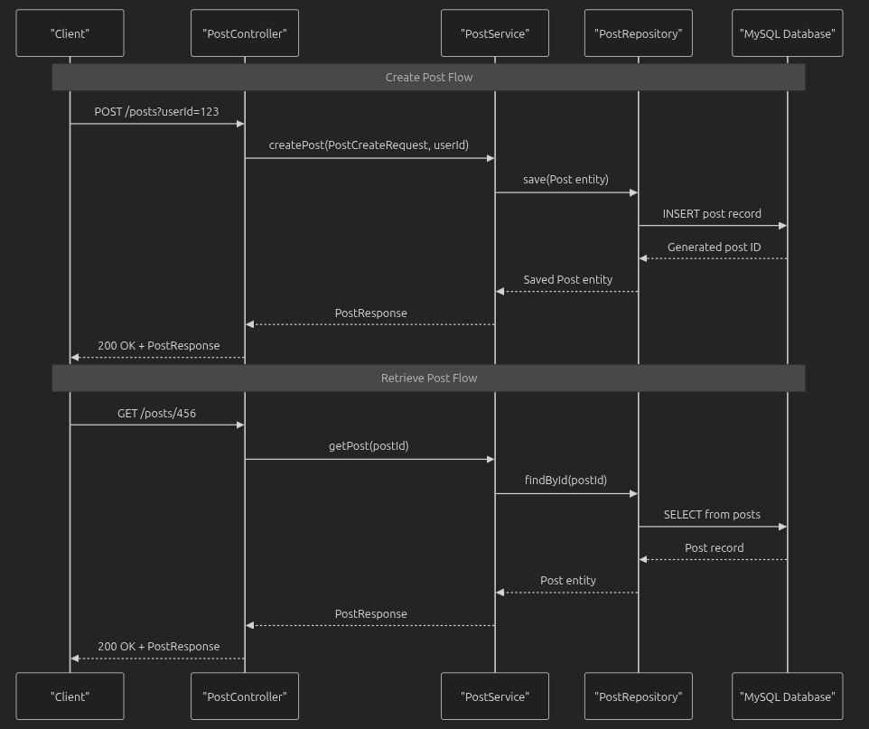

# 아키텍쳐


# API 엔드포인트


# ERD


# 요청, 응답 구조


# 데이터베이스 전달 구조 


---

# 인증  API 

### 애플리케이션 내에서 사용자 인증 및 계정을 관리하기 위한 세 가지 엔드포인트를 제공합니다.

# 인증 구조

### 모든 인증 작업은 서버 측 세션 저장소를 사용하는 HTTP 세션 기반 인증을 사용합니다.

---

## 등록


### POST /auth/signup

* 시스템에 새로운 사용자 계정을 만듭니다.

요청 본문:

* 유형:application/json

응답:
* 상태: 201 Created성공

* 본문: AuthResponse<SignResponse>사용자 정보 및 성공 메시지 포함

---

## 로그인 


### POST /auth/login

* 사용자 자격 증명을 인증하고 세션을 설정합니다.

### 요청 본문:

* 유형:application/json

### 세션 관리:
* 인증 성공 시 HTTP 세션을 생성합니다.
* 세션 속성을 설정합니다. (**SessionConstant.LOGIN_USER**)
* 세션에는 후속 요청에 대한 사용자 ID가 포함되어 있습니다.

### 응답:

* 상태: 201 Created성공

---

## 탈퇴


### DELETE /auth/me

* 인증된 사용자의 계정을 영구적으로 삭제합니다.
  
### 요청 매개변수:
* password(쿼리 매개변수): 검증을 위한 사용자의 현재 비밀번호

### 세션 검증:
* 기존 세션을 사용하여 확인 **request.getSession(false)**
* SessionConstant.LOGIN_USER 의 존재 여부를 검증합니다.
* 401 Unauthorized세션이 유효하지 않은 경우 반환합니다 .

### 응답:
* 상태: 200 OK성공
* AuthResponse<Void>성공 메시지 포함

---

### HTTP 상태 코드
| 작업 | 성공 상태     | 오류 상태          |
|----|--------------|-------------------|
| 가입 | `201 Created` | `400 Bad Request` |
| 로그인 | `201 Created` | `401 Unauthorized`|
| 탈퇴 | `200 OK`     | `401 Unauthorized`|

---

## 사용자 API


## 사용자 관계도


## 사용자 전달 구조


---

### 사용자 관리 API는 프로필 작업을 위한 네 가지 주요 엔드포인트를 제공합니다.
## GET /users/me
* 인증된 사용자에 대한 전체 프로필 정보를 검색합니다.

#### 매개변수:
* userId(쿼리, 필수): 인증된 사용자의 ID

---

## GET /users/{사용자 이름}
* 사용자 이름을 기준으로 특정 사용자의 공개 프로필 정보를 검색합니다.

#### 매개변수:
* username(경로, 필수): 프로필을 검색할 사용자의 사용자 이름

#### 개인 프로필과의 주요 차이점:
* 이메일 주소가 포함되어 있지 않습니다
* 공개적으로 볼 수 있는 정보만 반환됩니다.
* 세션이 필요하지 않습니다.

---

## PATCH /users/me
프로필 업데이트, 사용자 프로필 정보를 업데이트합니다.

#### 매개변수:
* userId(쿼리, 필수): 인증된 사용자의 ID

#### 검증 규칙:
* 사용자 이름은 필수 입력란입니다.

#### 응답:
* GET /users/me와 같은 형식으로 업데이트된 사용자 프로필을 반환합니다.

---

## PATCH /users/me/profile/image
* 사용자 프로필 이미지를 업데이트합니다.
* 프로필 이미지 관리

#### 매개변수:
* userId(쿼리, 필수): 인증된 사용자의 ID

#### 검증 규칙:
* ProfileImage는 필수 입력 항목입니다.

#### 응답
* 새로운 프로필 이미지 URL을 포함한 업데이트된 사용자 프로필을 반환합니다.
* 인증 및 권한 부여
* 공개 프로필 엔드포인트를 제외한 모든 사용자 관리 엔드포인트에는 인증이 필요합니다.

#### 매개변수:
* userId 쿼리 매개변수를 제공해야 합니다.

#### 권한:
* 사용자는 자신의 프로필 데이터에만 접근하고 수정할 수 있습니다.
* 공개 액세스: 엔드 /users/{username}포인트는 인증 없이 공개적으로 액세스 가능합니다.

---

## 검증 규칙 요약

| 필드          | 엔드포인트                           | 제약 조건          |
|---------------|---------------------------------|-------------------|
| `userId`      | GET `/users/me`           | 필수 |
| `username`    | GET `/users/{username}`           | 필수 |
| `username`    | PATCH `/users/me`               | 필수 |
| `profileImage`| PATCH `/users/me/profile/image` | 필수|

---

## 게시물 API


---



---

## API 개요
* 게시물 관리를 위한 CRUD(작성, 읽기, 업데이트, 삭제) 기능을 제공하는 5개의 엔드포인트로 구성됩니다.
* 모든 엔드포인트는 RESTful 규칙을 따르며 JSON 응답을 반환합니다.

## 엔드포인트 요약

| 방법     | 엔드포인트            | 설명         | 인증 여부 |
|--------|-----------------------|------------|-------|
| GET    | `/posts`              | 모든 게시물 검색  | O     |
| POST   | `/posts`              | 새로운 게시물 생성 | O     |
| GET    | `/posts/{postId}`     | 특정 게시물 검색  | O     |
| PUT    | `/posts/{postId}`     | 기존 게시물 업데이트 | O     |
| DELETE | `/posts/{postId}`     | 게시물 삭제     | O     |


* 데이터 구조, 요청 객체, API는 게시 작업에 두 가지 주요 요청 객체를 사용합니다.

### PostCreateRequest
* title(문자열, 필수): 최대 100자의 게시물 제목
* content(문자열, 필수): 최대 1000자의 게시물 내용
* postImage(문자열, 필수): 최대 100자까지 이미지를 게시할 수 있는 URL 또는 경로

### 업데이트 후 요청
* title(문자열, 필수): 최대 100자로 업데이트된 게시물 제목
* content(문자열, 필수): 최대 1000자로 업데이트된 게시물 내용
* postImage(문자열, 필수): 최대 100자로 업데이트된 게시물 이미지 URL

### 응답 객체
* id(long): 고유 게시물 식별자
* title(String): 게시물 제목
* content(String): 게시물 내용
* postImage(String): 이미지 게시 URL
* createdAt(datetime): 게시물 생성 타임스탬프
* modifiedAt(datetime): 마지막 수정 타임스탬프

---

## POST /posts
* 게시물 만들기
* 인증된 사용자를 작성자로 하여 새로운 게시물을 만듭니다.

---

## GET/ posts
* 모든 게시물 검색
* 시스템의 모든 게시물을 검색합니다.

---

## GET /posts/{postId} 
* 특정 게시물 검색
* ID로 단일 게시물을 검색합니다.

---

## PUT /posts/{postId}
* 업데이트 게시물
* 기존 게시물을 업데이트합니다.
* 게시물 작성자만 자신의 게시물을 업데이트할 수 있습니다.

---

<<<<<<< HEAD
## DELETE /posts/{postId}
* 게시물을 삭제합니다. 
* 게시물 작성자만 자신의 게시물을 삭제할 수 있습니다.
* 응답: 200 OK (빈 응답 본문)

---

### 비즈니스 규칙
* 모든 게시물의 생성, 업데이트 및 삭제 작업은 권한이 가능합니다.
* 사용자는 자신이 만든 게시물만 업데이트하거나 삭제할 수 있습니다.
* 게시물 ID는 유효한 긴 정수여야 합니다.
* 모든 문자열 필드는 길이 제약 조건에 대해 검증됩니다.
* 빈 문자열은 허용되지만 null 값은 허용되지 않습니다.

### 통합 지점
* 게시물 API는 PostControllerHTTP 요청 매핑 및 응답 형식 지정을 처리하는 클래스에 구현되어 있습니다.
* 컨트롤러는 다음과 통합됩니다.

### PostService 비즈니스 로직 처리를 위해
* 사용자 검증을 위한 인증 시스템
* 입력 정리를 위한 요청 검증 프레임워크
* 서비스 계층 통합

### PostService 컨트롤러와 저장소 계층 간의 좌표 
* 게시물 생성, 검색, 업데이트 및 삭제 논리를 관리합니다.
* 비즈니스 규칙 및 소유권 검증을 시행합니다.
* DTO와 엔터티 간의 데이터 변환을 처리합니다.
* 데이터베이스 통합
* 게시물은 다음을 사용하여 유지됩니다.
* PostRepositorySpring Data JPA 저장소 인터페이스 확장
* Post게시물 테이블에 매핑된 엔터티
* 영구 저장소를 위한 MySQL 데이터베이스
* 교차 기능 통합

### 게시물 API는 다른 시스템 구성 요소와 통합됩니다.
* 사용자 관리 : 게시물 소유권은 다음을 통해 사용자 계정에 연결됩니다.
* 소셜 기능 : 게시물에 좋아요를 누르고 사용자 피드에 표시될 수 있습니다.
* 인증 : 쓰기 작업에는 유효한 사용자 세션이 필요합니다.

---

## 소셜 기능 API
## 소셜 구조


## 소셜 컨트롤러


### 팔로우/팔로우 취소 기능

| 엔드포인트                          | 방법   | 목적                              |
|-------------------------------------|--------|-----------------------------------|
| `/users/{targetUserId}/follow`      | POST   | 특정 사용자를 팔로우         |
| `/users/{targetUserId}/follow`      | DELETE | 특정 사용자 팔로우 취소            |
| `/users/{targetUserId}/relationship`| GET    | 사용자를 팔로우하고 있는지 확인 |

### 팔로우 관리 시스템
* 플랫폼 내에서 소셜 관계를 생성하고 관리할 수 있습니다.
* 팔로우/언팔로우, 관계 상태 확인, 팔로워/팔로우 목록 조회를 위한 엔드포인트를 제공합니다.

---

## 팔로워 및 팔로잉 목록

| 엔드포인트               | 방법 | 목적               |
|--------------------------|------|------------------|
| `/users/me/following`    | GET  | 팔로우하는 사용자 확인     |
| `/users/me/followers`    | GET  | 당신을 팔로우하는 사용자 확인 |

### 개인화된 피드 생성
* 인증된 사용자가 팔로우하는 사용자의 게시물을 집계하여 개인화된 콘텐츠를 생성합니다.

---

## 팔로우 사용자 게시물

| 엔드포인트             | 방법 | 목적                |
|------------------------|------|-------------------|
| `/users/follow/posts`  | GET  | 팔로우하는 사용자의 게시물 확인 |

### 피드 엔드포인트 팔로우
* 팔로우된 사용자의 게시물을 정리하여 피드로 제공합니다.

---

## 좋아요/좋아요 취소 기능
| 엔드포인트              | 방법 | 목적               |
|-------------------------|------|------------------|
| `/feeds/{feedId}/like`  | GET  | 게시물에 대한 좋아요 정보 확인 |
| `/feeds/{feedId}/like`  | POST | 게시물의 좋아요 상태 변경   |

### 좋아요 및 참여 시스템
* 게시물에 '좋아요'를 표시하고 '좋아요' 통계를 확인할 수 있습니다.
* 피드 ID를 사용하여 '좋아요' 작업을 위한 게시물을 식별합니다.

---

## 좋아요 구조
```
{
"liked": true,
"likeCount": 42
}
```
* LikeResponse 객체는 사용자의 좋아요 상태와 총 좋아요 수를 모두 제공합니다.
* liked: 현재 사용자가 게시물을에 좋아요를 눌렀는지 알려주는 값입니다. 
* likeCount: 게시물이 받은 총 좋아요 수입니다.

---

### 토글 동작
* POST 엔드포인트는 토글 메커니즘을 구현합니다.
* 사용자가 게시물에 좋아요를 누르지 않은 상태라면 좋아요가 추가됩니다.
* 사용자가 게시물에 좋아요를 눌렀던 상태라면 기존 좋아요가 제거됩니다.
* 업데이트된 좋아요 상태 및 개수를 반환합니다.

---

### 인증 요구 사항
* 모든 소셜 기능 엔드포인트는 userId 쿼리 매개변수를 통한 사용자 인증을 요구합니다.
* 이 매개변수는 작업을 수행하는 인증된 사용자를 식별하며, 다음과 같은 경우에 필요합니다.

---

### 접근 제어 (사용자는 자신의 팔로우/좋아요만 관리할 수 있음)
* 개인화(사용자별 피드 및 좋아요 상태 생성)
* 감사 추적(누가 어떤 소셜 활동을 수행했는지 추적)
* 팔로우 및 좋아요 관계에서 데이터 무결성 유지

---

## Core Spring Components

| Starter                      | Version | Key Classes                         |Purpose                      |
|-----------------------------|-------|------------------------------------|-----------------------------|
| `spring-boot-starter-web`   | 3.5.4 | `@RestController`, `@RequestMapping` | REST API endpoints and MVC   |
| `spring-boot-starter-data-jpa` | 3.5.4 | `@Repository`, `JpaRepository`     | Data persistence and ORM       |
| `spring-boot-starter-security` | 3.5.4 | `@EnableWebSecurity`               | Authentication and authorization         |
| `spring-boot-starter-validation` | 3.5.4 | `@Valid`, `@NotNull`              | Input validation                |
| `spring-boot-starter-actuator`  | 3.5.4 | Management endpoints                     | Application monitoring       |


---

## Persistence Components

| Component                 | Version      | Configuration                   | Purpose                 |
|----------------------|------------|-----------------------|------------------------|
| Hibernate Core           | 6.6.22 Final| Auto-configured via Spring Boot | Object-relational mapping          |
| HikariCP             | 6.3.1      | Default connection pool              | Database connection pooling   |
|MySQL Connector/J| 9.3.0      | Runtime dependency              | MySQL database driver |
| Jakarta Persistence API         | 3.1.0      | JPA 3.1 specification            | Standard persistence API        |

---

## Security Components

| Component             | Version           | Key Features                                |
|------------------|------------------|------------------------------------------|
| Spring Security  | 6.2.9            | Authentication, authorization, CSRF protection            |
| BCrypt           | 0.10.2           | Password hashing with configurable rounds |
| jakarta Security | Via Spring Security | Security annotations and APIs                       |

